# A 2-Tier Campus Network Based off a Fictional Malaysian Company GoldenHarvest Bhd
[Author](inkedin.com/in/collins-amalimeh/): Collins Chinedu Amalimeh.

## Project Overview 
This project is based on a solution provided to a fictional poultry company operating in Malaysia that required operational network coverage connecting each segments of the company and providing access to internet.

The LAN architecture used is a `2‑tier design` single homed, consisting of a star topology at the access layer and a `hub‑and‑spoke` arrangement at the distribution layer.

The network design fulfills the company’s requirements for internet access, hosting internal and public‑facing web servers, and supporting centralized **DNS**, **NTP**, **DHCP**, **FTP**, and **Syslog** services. The solution also meets operational needs while placing lower priority on high availability or uptime.

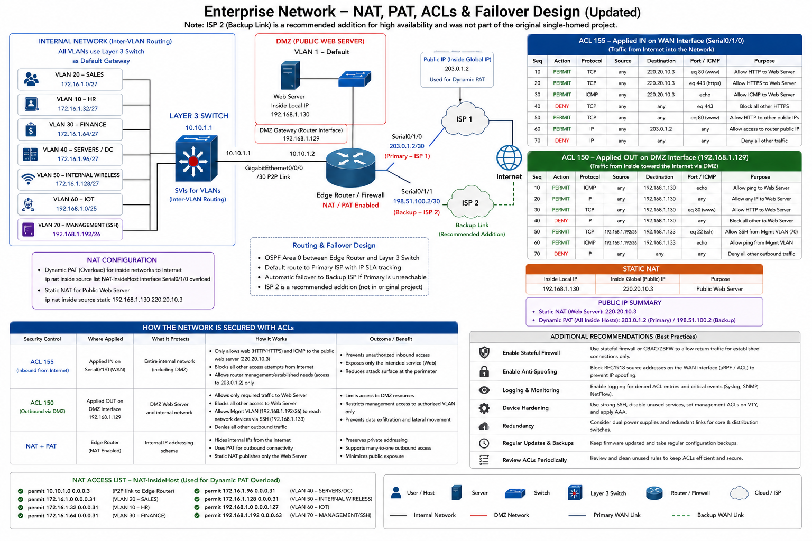
---

## Summary of Network Protocols and Services configured

| **Category** | **Protocols / Skills** |
| --- | --- |
| **Layer 2** | VLANs, Switchport Security, EtherChannel (LACP), 802.1Q Trunking, RSTP (802.1w), SSH/Console, Wireless (802.11), Switching |
| **Layer 3** | OSPF, EIGRP, Static Routing, Floating Static Routes, Dynamic NAT, PAT, ACLs, Routing |
| **Infrastructure Services** | NTP, DNS Configuration, DHCP Configuration, FTP Server Setup, Web Hosting (HTTP), Syslog |
| **IP Addressing** | VLSM, CIDR, Subnetting, Address Planning |
| **Other Skills** | Network Documentation, Basic Security Hardening, Topology Design |

---


## TABLE OF CONTENTS
-  [Logical Network Topology](#network-topology)
-  [Company Inside Zones](#project-overview)
-  [Company Inside Zones](#company-inside-zones)
-  [Hosted Resources](#-----------hosted-resources------------)
    -  [Internal Web Application Portal](#internal-web-application-portal) 
    - [The DATA CENTER](#the-data-center)
    - [Internal Web Server](#internal-web-server)
    - [Public Web Server](#public-web-server)
    - [DHCP Server](#dhcp-server)
    - [NTP Server](#ntp-server)
    - [DNS Server](#dns-server)
    - [Syslog Server](#syslog-server)
    - [FTP Server](#ftp-server)
-   [Dynamic NAT & PAT](#dynamic-nat--pat)
-   [Layer 3 Switch Routing Table Breakdown](#layer-3-switch-routing-table-breakdown)


---

### LOGICAL NETWORK TOPOLOGY 
**Figure 1.0** - Two physically separated networks
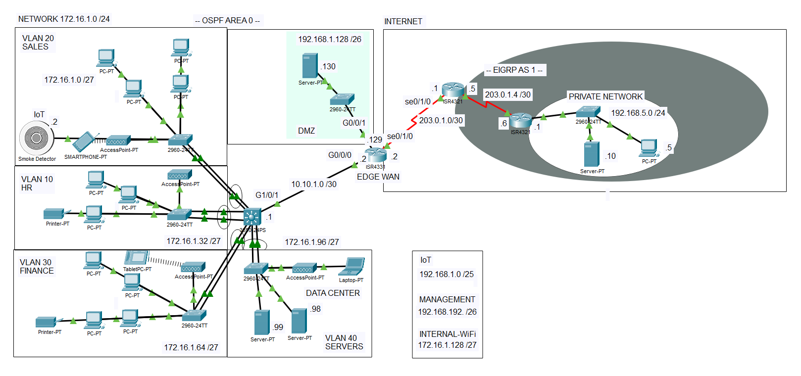
This logical network topology is a segmented campus LAN made up of multiple VLANs, each mapped to a specific department or zone with its own IP subnet and all aggregating at the distribution layer which is a layer 3 switch using SVIs interfaces that provides a default gateway for individual zones. The distribution layer connects to an up link North Bond to the Edge WAN router connecting the network out to the internet 

 The campus lan encompases user departments such as Human Resources, Sales, and Finance that are placed in separate VLANs within the `172.16.1.0/24` space, while infrastructure and special-purpose zones—Servers, WiFi‑Internal, IoT, Management Line, DMZ, and WiFi‑Guest—are allocated distinct subnets in both the `172.16.1.0/24` and `192.168.1.0/24` ranges.

This design further provides clear separation between user traffic, server resources, management access, IoT devices, and externally exposed services in the DMZ, supporting better security, traffic control, and policy enforcement withing this network.

---

### COMPANY INSIDE ZONES
Table 1.0: Inside Zones and associated VLANs
| **VLAN No.** | **Department / Zone** | **Subnet / Prefix** |
| --- | --- | --- |
| 10 | Human Resources | 172.16.1.32/27 |
| 20 | Sales | 172.16.1.0/27 |
| 30 | Finance | 172.16.1.64/27 |
| 40 | Servers | 172.16.1.96/27 |
| 50 | WiFi – Internal | 172.16.1.128/27 |
| 60 | IoT | 192.168.1.0/25 |
| 70 | Management Line | 192.168.1.192/26 |
| 80 | DMZ | 192.168.1.128/26 |
| — | WiFi – Guest | — |


---
### ---------- HOSTED RESOURCES -----------

### The DATA CENTER

A set of internal servers (FTP, NTP, HTTP, DHCP, DNS) is hosted in a secure closet in this protected network and is accessible only to specific internal zones: Human Resources, Finance, Sales, Servers, and Management. Other zones, such as WiFi‑Internal, IoT, DMZ, and the public internet are restricted from accessing these resources.
This access policy is enforced using ACLs to monitor and only permit traffic within the specified subnets.

> Due to limitation of the simulation software the policy was not applied to the necessary interfaces.``` 

### Internal Web Server

**Figure 2.0** - Internal Web Server
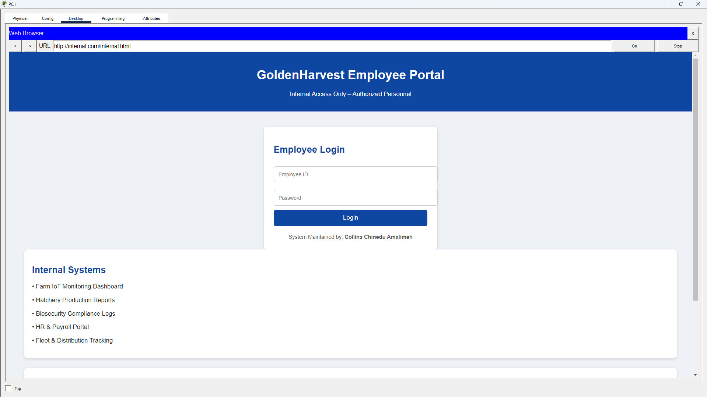
An internal web server is hosted to provide the company’s employee portal for administrative tasks. This webpage show in *Figure 2.0* is served from the Cisco Packet Tracer server in the DMZ zone under the domain name [`internal.com`](#/), which resolves to the inside local IP address `172.16.1.99` assigned to the web server NIC.


### Public Web Server
**Figure 3.0** - Public Web Server
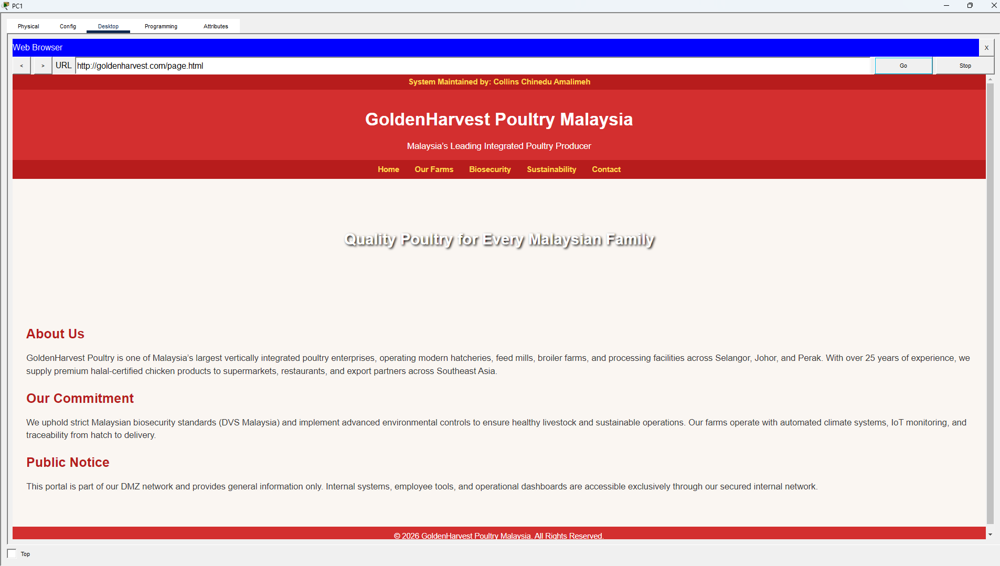
A public‑facing web server is hosted in the DMZ zone and is accessible to internet users as well as internal zones that require access. This server provides external services while remaining isolated from the core internal network for security purposes.

---

### DHCP Server
A centralized DHCP server in the DATA CENTER hosted in the Servers VLAN to provide dynamic IP addressing and configuration to all subnets and their associated workstations. All servers, printers operate with static IP addresses, while client devices obtain their configurations through DHCP including IoT devices. 

Each subnet reaches the DHCP server through a relay agent configured on its default gateway, ensuring proper forwarding of DHCP requests across VLAN boundaries.

**Figure 4.0** - Central DHCP Server
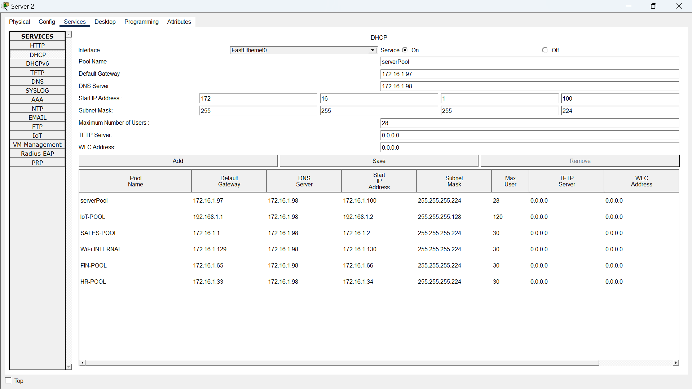

---

 ### NTP Server

Devices in the internal subnets except for the DMZ and the Edge WAN synchronize their clocks with a central NTP server. This ensures consistent and accurate timestamps across logs, events, and system messages throughout the network. 

- Configuration 

```
NTP server <IP Address>
```

- Verification Commands
```
show ntp status
show ntp associations
show clock details
``` 
The output of the NTP verification commands as show in *figure 5.0* confirms that the devices are synchronizing with the central NTP server, which operates at stratum 1. Client devices synchronizing to this server operate at stratum 2.  Stratum values indicate the accuracy and trustworthiness of a time source. A device will not synchronize with any NTP server above stratum 15.

Due to limitations in Cisco Packet Tracer, switches cannot be configured with multiple NTP servers, while routers can. This reflects real‑world behavior where routers often act as NTP clients or servers and may synchronize to multiple upstream time sources for redundancy.

**Figure 5.0** - Central DHCP Server
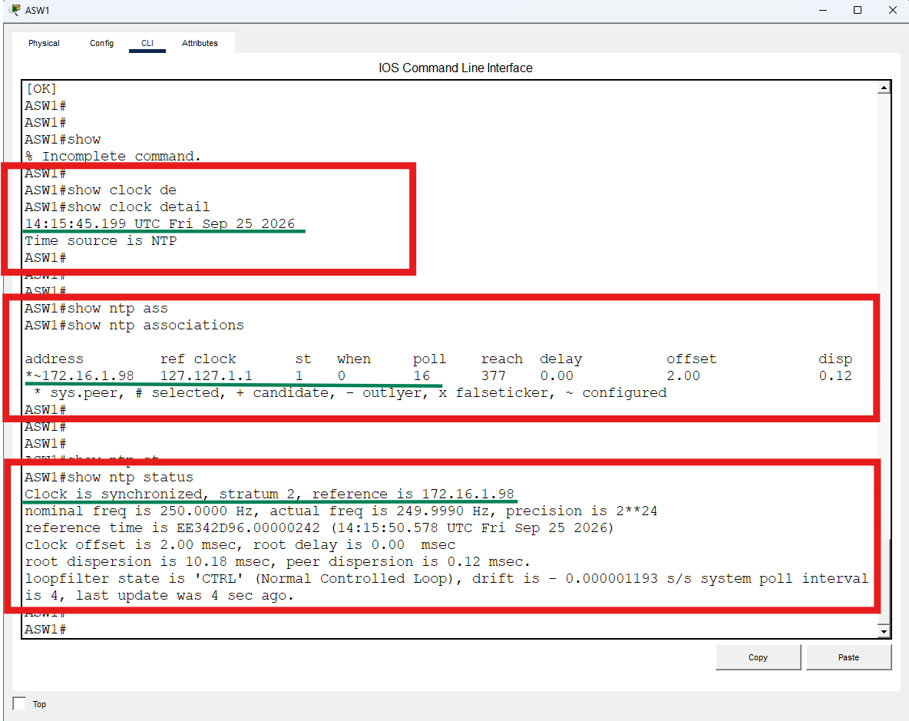

---

 ### DNS Server

A centralized DNS server is provisioned within the network to provide domain‑name resolution for internal hosts. DNS information such as the server’s IP address and the domain name is automatically delivered to clients through the DHCP server, ensuring that all devices can resolve internal and external domain names without manual configuration. 

 **Figure 6.0** - Central DNS Server
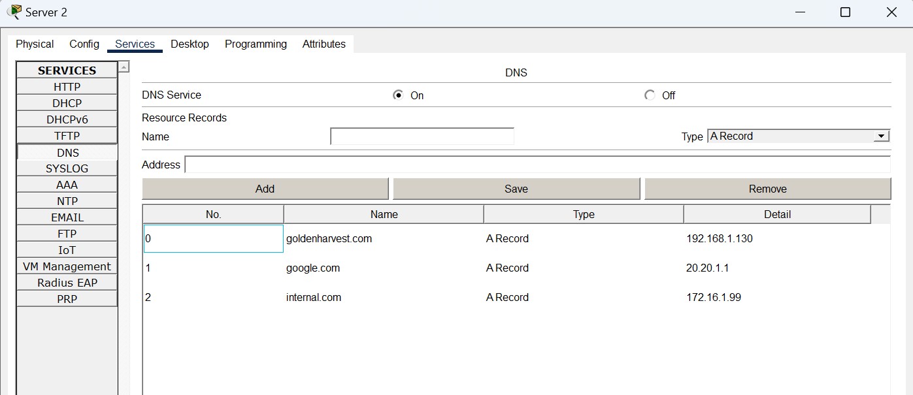


 ### Syslog Server

A Syslog server is deployed within the LAN to store log messages in a centralized location. Centralized logging is essential for troubleshooting, auditing, and tracking events across the network. With accurate timestamps, provided through NTP synchronization; it becomes much easier to trace the origin of issues and correlate events between devices.

In this project, a Syslog server is used to collect and store logging messages from network devices, providing a single point for monitoring system activity and diagnosing problems.


- Configuration 

```
Logging host <IP Address>
```


- Verification Commands
```
show logging
``` 

 **Figure 7.0** - Central Syslog Server
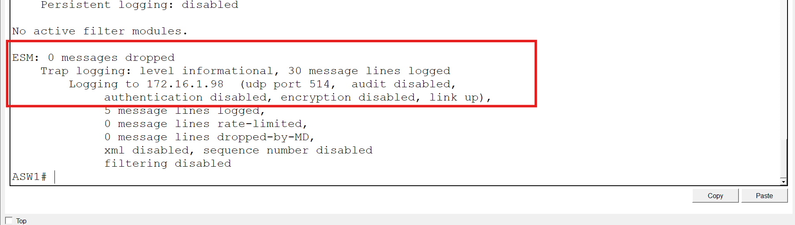

 **Figure 8.0** - Stored Logged messages in Server
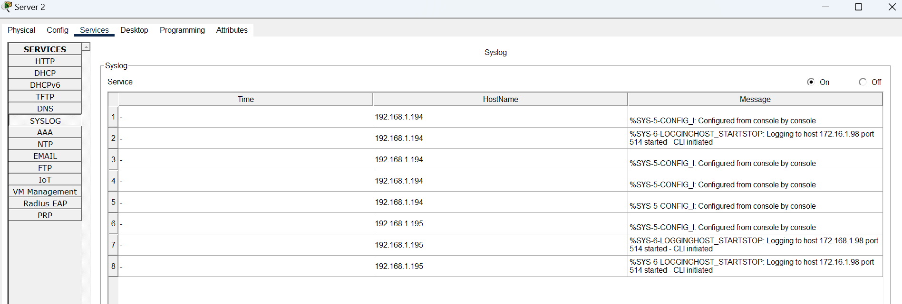


---

> **NOTE:** A device can be configured to send log messages to multiple Syslog servers simultaneously.

---

### FTP Server

An FTP server is available to the internal network for centralized file storage. It can be used for tasks such as backing up or storing IOS images before performing device upgrades, as well as providing shared storage for user departments. Only internal zones with the appropriate access permissions can reach the FTP service, ensuring controlled and secure file transfers within the network.

On each network device, a local username and password have been configured to match the credentials created on the FTP server. These credentials determine the access level assigned to each device by their login information, as shown in *Figures 8* and *9*.

 **Figure 9.0** - FTP Server credentials
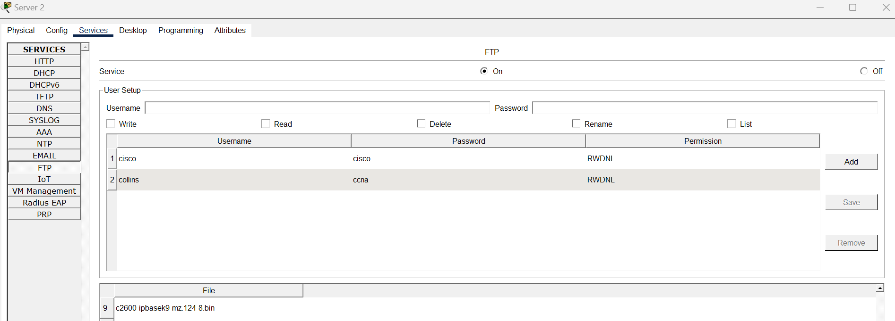


> Certain permissions are assigned to each user account, such as the ability to write, delete, rename, list, or read files.

---

### DYNAMIC NAT & PAT
Two types of NAT implementations are used in this network: Static NAT and Dynamic Port Address Translation (PAT).

Static NAT is configured for the public‑facing web server. It maps the inside local IP address `192.168.1.130` to the inside global public IP address `220.20.10.3`. This one‑to‑one translation ensures that external users can reach the public server using a routable public address.

Dynamic PAT is used for all outbound traffic from the internal network to the internet. It translates multiple inside hosts to the single public IP address assigned by the service provider on the WAN interface `203.0.1.2`. PAT uses unique source port numbers to differentiate sessions, allowing many devices to share one public IP.

This design ensures that only traffic originating from the inside network is allowed back into the network. It also prevents unsolicited inbound traffic from reaching internal hosts, effectively shielding the internal network. For the static NAT entry, the router creates a translation in the NAT table, so any packet destined for the inside global address is translated back to the inside local address and forwarded to the server.

Using PAT also prevents public IP address wastage, since internal devices do not require individual public IPs.

Because PAT does not create a translation until a device initiates traffic, hosts inside the network cannot be accessed directly from the internet. Any inbound packet without an existing translation is dropped.

 **Figure 10.0** - NAT and PAT Topology Overview
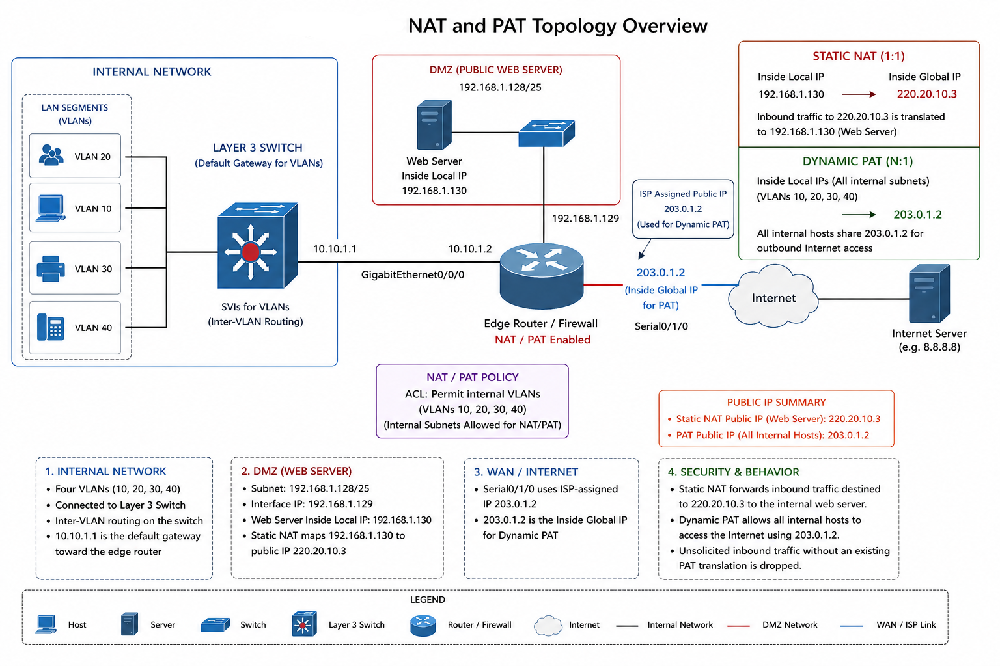


- Configuration 

```

---- NAT INTERFACES CONFIGURATION ----
interface GigabitEthernet0/0/0
 ip address 10.10.1.2 255.255.255.252
 ip nat inside
!
interface GigabitEthernet0/0/1
 ip address 192.168.1.129 255.255.255.192
 ip nat inside
!

interface Serial0/1/0
 ip address 203.0.1.2 255.255.255.252
 ip nat outside
!


---- NAT POOL CONFIGURATION -----
ip nat pool hostNAT 220.20.10.1 220.20.10.15 netmask 255.255.255.240

---- DYNAMIC PAT CONFIGURATION ---- 
ip nat inside source list NAT-InsideHost interface Serial0/1/0 overload

---- STATIC NAT CONFIGURATION ----
ip nat inside source static 192.168.1.130 220.20.10.3


---- NAT ACCESS LIST POLICY ---- 

--- NAT POOL ---
Standard IP access list NAT-InsideHost
    10 permit 172.16.1.0 0.0.0.31
    20 permit 172.16.1.32 0.0.0.31
    30 permit 172.16.1.64 0.0.0.31
    40 permit 172.16.1.128 0.0.0.31

--- ON WAN INTERFACE TO ISP ---
Extended IP access list 150
    10 permit icmp any host 192.168.1.130
    20 permit ip any host 192.168.1.130
    30 permit tcp any host 192.168.1.130 eq www
    40 deny ip any host 192.168.1.130
    50 permit tcp 192.168.1.192 0.0.0.63 host 192.168.1.133 eq 22
    60 permit icmp 192.168.1.192 0.0.0.63 host 192.168.1.133
    70 deny ip any any

--- ON DMZ INTERFACE ---
Extended IP access list 155
    10 permit tcp any host 220.20.10.3 eq www
    20 permit tcp any host 220.20.10.3 eq 443
    30 permit icmp any host 220.20.10.3
    40 deny tcp any any eq 443
    50 permit tcp any any eq www
    60 permit ip any host 203.0.1.2 
    70 deny ip any any 

```


- Verification Commands
```
show ip nat translations 
--output--
Pro  Inside global     Inside local       Outside local      Outside global
---  220.20.10.3       192.168.1.130      ---                ---
```

---

### LAYER 3 SWITCH ROUTING TABLE BREAKDOWN
 ---- **Connected Networks (Directly Attached VLANs & Links)** ----

| Network          | Subnet Mask     | Interface | Type | Description                        |
| ---------------- | --------------- | --------- | ---- | ---------------------------------- |
| 10.10.1.0/30     | 255.255.255.252 | Gi1/0/1   | C    | Point-to-point link to Edge Router |
| 10.10.1.1/32     | /32             | Gi1/0/1   | L    | Local interface IP (L3 Switch)     |
| 172.16.1.0/27    | 255.255.255.224 | VLAN 20   | C    | Sales VLAN                         |
| 172.16.1.1/32    | /32             | VLAN 20   | L    | SVI for Sales                      |
| 172.16.1.32/27   | 255.255.255.224 | VLAN 10   | C    | HR VLAN                            |
| 172.16.1.33/32   | /32             | VLAN 10   | L    | SVI for HR                         |
| 172.16.1.64/27   | 255.255.255.224 | VLAN 30   | C    | Finance VLAN                       |
| 172.16.1.65/32   | /32             | VLAN 30   | L    | SVI for Finance                    |
| 172.16.1.96/27   | 255.255.255.224 | VLAN 40   | C    | Servers / Data Center VLAN         |
| 172.16.1.97/32   | /32             | VLAN 40   | L    | SVI for Servers                    |
| 172.16.1.128/27  | 255.255.255.224 | VLAN 50   | C    | Internal Wireless VLAN             |
| 172.16.1.129/32  | /32             | VLAN 50   | L    | SVI for Wireless                   |
| 192.168.1.0/25   | 255.255.255.128 | VLAN 60   | C    | IoT VLAN                           |
| 192.168.1.1/32   | /32             | VLAN 60   | L    | SVI for IoT                        |
| 192.168.1.192/26 | 255.255.255.192 | VLAN 70   | C    | Management (SSH) VLAN              |
| 192.168.1.193/32 | /32             | VLAN 70   | L    | SVI for Management                 |

---

---- **Learned Routes (OSPF & Static)** ----

| Network          | Route Type        | Next Hop  | Interface | AD / Metric | Description                        |
| ---------------- | ----------------- | --------- | --------- | ----------- | ---------------------------------- |
| 192.168.1.128/26 | OSPF              | 10.10.1.2 | Gi1/0/1   | 110 / 2     | DMZ Network (via Edge Router)      |
| 172.16.2.1/32    | OSPF              | 10.10.1.2 | Gi1/0/1   | 110 / 2     | Edge Router Management IP          |
| 172.16.2.0/30    | Static (Floating) | 10.10.1.2 | —         | 115 / 0     | Backup route to management network |
---

---- **Default Route** ----
| Route     | Type    | Next Hop  | Interface | AD / Metric | Description                               |
| --------- | ------- | --------- | --------- | ----------- | ----------------------------------------- |
| 0.0.0.0/0 | OSPF E2 | 10.10.1.2 | Gi1/0/1   | 110 / 1     | Default route to Internet via Edge Router |
---

**Key Observations**


| Feature            | Explanation                                                    |
| ------------------ | -------------------------------------------------------------- |
| Default Gateway    | All VLANs use L3 Switch → Forwarded to Edge Router (10.10.1.2) |
| Inter-VLAN Routing | Handled locally on the Layer 3 switch via SVIs                 |
| DMZ Reachability   | Learned dynamically via OSPF from Edge Router                  |
| Management Network | Advertised via both OSPF and floating static route             |
| Redundancy Logic   | Floating static route (AD 115) acts as backup to OSPF (AD 110) |

----

### OTHER IMPLEMENTED TECHNOLOGIES AND CONFIGURATIONS

| Category                       | Feature                      | Description                                                                                   | Purpose / Benefit                                                             |
| ------------------------------ | ---------------------------- | --------------------------------------------------------------------------------------------- | ----------------------------------------------------------------------------- |
| **Management Access**          | SSH & Console Configuration  | Secure remote access configured on all network devices using SSH; console access also enabled | Ensures secure device management and prevents unauthorized access (no Telnet) |
| **Layer 2 Security**           | Switchport Security          | Enabled on all active access ports with a maximum of 1 MAC address                            | Prevents unauthorized devices from connecting to the network                  |
| **Layer 2 Design**             | VLAN Segmentation            | Multiple VLANs implemented (HR, Sales, Finance, Servers, Wireless, IoT, Management)           | Logical separation of network traffic for security and performance            |
| **Trunking**                   | IEEE 802.1Q                  | Trunk links configured between switches                                                       | Allows multiple VLANs to traverse a single link                               |
| **Loop Prevention**            | STP (802.1D) & RSTP (802.1W) | Rapid Spanning Tree Protocol enabled with fallback compatibility                              | Prevents Layer 2 loops and ensures fast convergence                           |
| **Spanning Tree Optimization** | Root Bridge Placement        | Distribution Layer Switch configured as root bridge for all VLANs                             | Provides optimal path selection and predictable traffic flow                  |
| **Link Aggregation**           | EtherChannel (LACP)          | LACP-based EtherChannel configured between Distribution and Access layers                     | Increases bandwidth and provides redundancy between switches                  |
| **Wireless Networking**        | Internal Wireless (VLAN 50)  | Wireless network deployed for staff devices                                                   | Enables mobility and flexible access for users                                |
| **Network Architecture**       | Hierarchical Design          | Access → Distribution (L3 Switch) → Edge Router                                               | Improves scalability, performance, and manageability                          |


### Thank you for taking the time to go through my project and repository. I truly appreciate your time and consideration.
