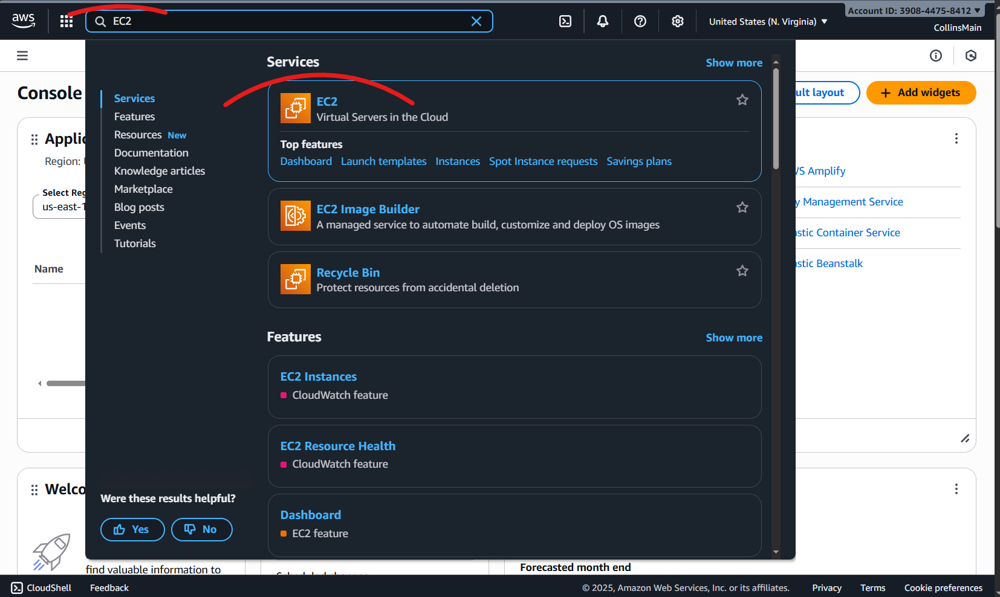
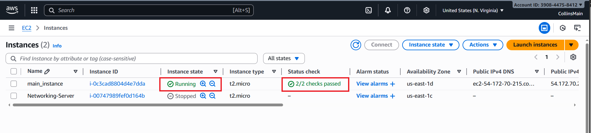

# **Troubleshooting SSH Connectivity Issue for AWS Ec2-Instane**

> **Category:** Networking / Virtualization / Security / Storage / Cloud  
> **Date:** 2025-10-12  
> **Author:** `Collins Chinedu Amalimeh`
> **Tools Used:** `AWS EC2 documentation`
> **Difficulty Level:** `Beginner` / `Intermediate` / Advanced  
> **Status:** 🧭 In Progress
<!-- ✅ Completed 🧭 In Progress/  -->
---
<!-- JUNIOR TECH SERVICE SPECIALIST -->

## 📝 **Project Overview**
In this lab, I will provide a step-by-step guild on fixing `AWS-Ec2-Instance` connectivity issues **(for SSH connections)**. This error usually means your EC2 instance’s network settings are blocking the connection. The most common causes are misconfigured Security-groups, Network ACLs blocking traffic to the instance, missing public IP, or subnet issues.

---
## 🎯 **Objectives**
To Ensure SSH connectivity to the EC2 instance by checking the network ACLs, security group, and routing table for misconfigurations.

  
A logged in shell session from EC2 Instance Connect on the AWS console.

---

 ## ⚙️ **Configuration Steps**
 Step 1: Checking Security groups.
 ### In progress...

 ---

 ### Accessing your EC2 instance from home.
 ``In the search bar type EC2, hover your mouse on EC2 to expand it, cllick instances under EC2.``
 
Before starting the configuration lets start the instance and make sure your instance is in the “running” state, also confirm it has passed both status checks.

 
 --

``In this Demo, I have two instances, and one `The main_instance` is currently running, click the check button to display information about the intance ``

---
## **Step 1: Check Security Groups**

``On the selected instance's Tab, click Security, underneath click Security groups.``

_Observe the name of the security groups the instance is attached to. A Secutrity Group is a Virtual Firewall, that we can create and associate an instance, subnet or VPC to, with it, we can allow or block traffic based on type, IP version and IP address_

---
On the next page, there will be more information about your security gruop. The Inbound Tab, and Outbound tab show configured traffic type that is allow in of our instance. If there is no configured Inbound rule that allows SSH traffic you have to click the edit Inbound rules to add an inbound rule for SSH access. 

``Note!`` The security group shown allows inbound SSH on port 22. However, that's not enough; an outbound rule is also required to let traffic exit the instance. **_(This was the exact fix for my SSH connectivity issue.)_**

---

``On the Inbound rules tab, click the edit Inbound rules button to add a new Inbound rule, do the same to add Inbound Rule``

As mentioned above, the outbound rules allow traffic to leave the instance, we can also configure only specific types of traffic to exit the istance. In the next step, we will add two new rules, one Inbound rules, and one Outbound rule.

---

View the existing rules, in this Demo,  I have one Inbound rule allowing only SSH traffic for remote connection. I will assume I am also hosting a web server in the ec2 isntance, so I will add an inbound rule that allows https access to the web server.

`Note!` for security reasons when adding an inbound rules for SSH connections, only allow trafic from know IP addresses. `0.0.0.0/0` allows traffic from all addresses.

``Click the Add rules  button`` 

``under Type choose HTTPS, port 443 will be automaically assigned, source type 0.0.0.0/0 to allow traffic from all ip address``

---
``preview and click save``

we do not need to add another Outbound rules because the existing outbound rules alows all type of traffic to exit the instance. 

---