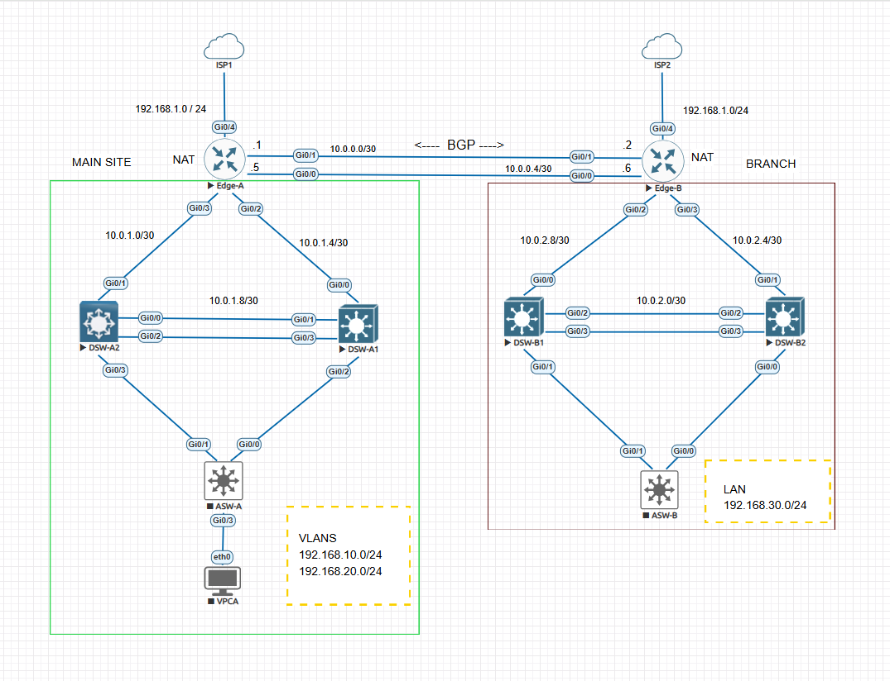
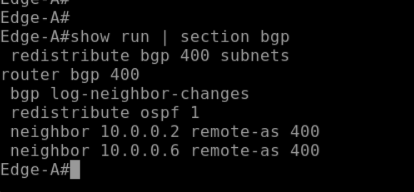
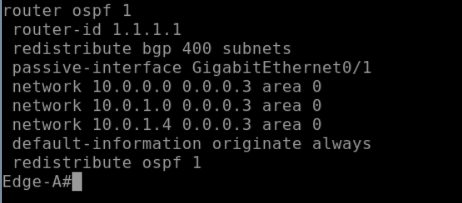
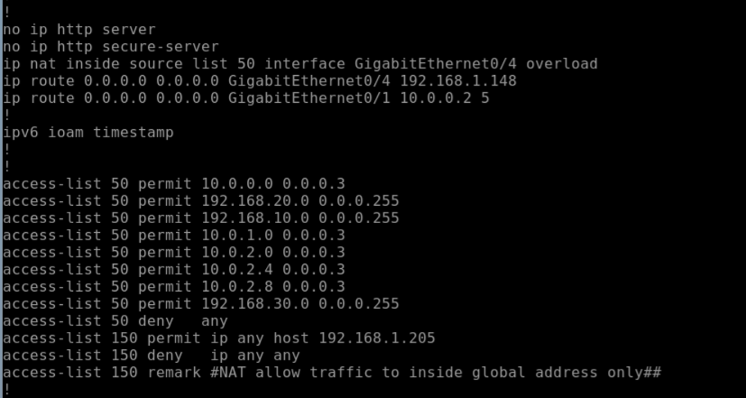
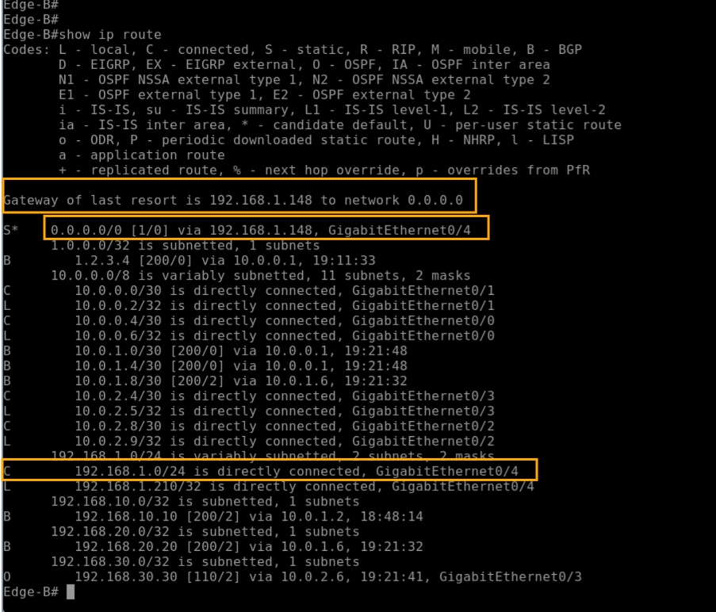
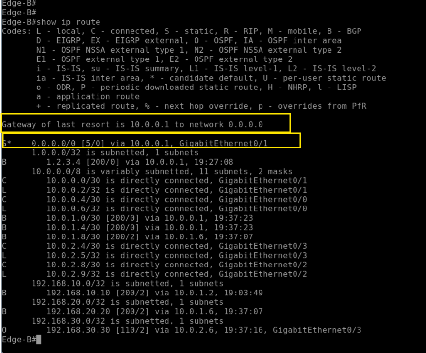
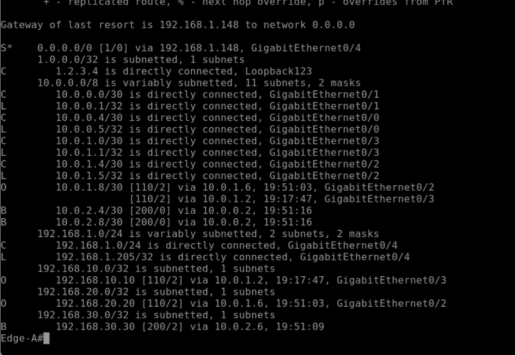

# Site-to-Site Network Routing and Internet Redundancy Using BGP

## Project Overview

This project demonstrates a highly available site-to-site network architecture connecting a Main Site and a Branch Site using BGP for route exchange and OSPF as the internal routing protocol.

The objective is to provide:

* Dynamic route distribution between sites using BGP
* Internal route propagation using OSPF
* Internet connectivity through local ISP connections at each site
* Automatic failover to the remote site when a local Internet connection becomes unavailable
* Secure Internet access using NAT/PAT

Both sites are single-homed to their respective ISPs and exchange routes through redundant BGP links. High availability is achieved through floating static routes that automatically redirect Internet-bound traffic through the remote site during an ISP outage.

---

## Network Topology

### Main Site VLANs

| VLAN    | Network         |
| ------- | --------------- |
| Users   | 192.168.10.0/24 |
| Servers | 192.168.20.0/24 |

### Branch Site VLANs

| VLAN  | Network         |
| ----- | --------------- |
| Users | 192.168.30.0/24 |

---

## Technologies Used

* BGP (Border Gateway Protocol)
* OSPF (Open Shortest Path First)
* NAT/PAT
* ACLs (Access Control Lists)
* Floating Static Routes
* VLAN Segmentation
* NTP
* DNS

---

# BGP Configuration

BGP is used to exchange routes between the Main Site and Branch Site over two redundant WAN links.

### Key Benefits

* Dynamic route advertisement between sites
* Fast convergence during link failures
* Redundant path availability
* Scalability for future site additions

---

# OSPF Configuration

OSPF is used as the Interior Gateway Protocol (IGP) within each site.

### Route Redistribution

OSPF routes are redistributed into BGP, while BGP routes are redistributed back into OSPF.

This design provides:

* End-to-end route reachability
* Controlled separation between internal and external routing domains
* Efficient propagation of remote site networks
* Reduced exposure of OSPF link-state information outside each site

---

# NAT (PAT Overload) and Access Control Lists

Internet access is provided through Port Address Translation (PAT).

### NAT Implementation

* Internal private addresses are translated to a public IP address
* Multiple hosts share a single public IP using PAT overload
* ACLs identify traffic eligible for translation

### Security Benefits

* Internal IP addressing remains hidden from external networks
* Only authorized traffic is translated and allowed outbound
* Basic protection against unsolicited inbound connections

---

# High Availability Using Floating Static Routes

To ensure uninterrupted Internet access, both sites implement:

* Primary default route through the local ISP
* Floating static route through the remote site

The floating static route remains inactive until the primary route becomes unavailable.

---

## Failover Scenario

When the Branch Site ISP connection fails, the primary default route is removed from the routing table.

The floating static route immediately becomes active, forwarding Internet-bound traffic through the Main Site.

### Result

* Users maintain Internet connectivity
* Traffic exits through the Main Site Internet connection
* No manual intervention is required
* Service disruption is minimized

Once the ISP connection is restored, routing automatically reverts to the preferred local path.

---

# Route Verification

The routing table confirms successful BGP route exchange between both sites.

Remote site networks are dynamically learned through BGP and redistributed internally through OSPF.

---

# Infrastructure Services

The following supporting services were configured:

| Service | Purpose                      |
| ------- | ---------------------------- |
| DNS     | Domain name resolution       |
| NTP     | Time synchronization         |
| NAT/PAT | Internet access              |
| ACLs    | Traffic control and security |
| OSPF    | Internal route propagation   |
| BGP     | Inter-site route exchange    |

Public DNS servers from Google and Cloudflare were used for name resolution.

---

# Key Skills Demonstrated

* Enterprise Routing and Switching
* BGP Route Advertisement and Redistribution
* OSPF Design and Operations
* High Availability Network Design
* Internet Failover Implementation
* NAT/PAT Configuration
* Access Control Lists (ACLs)
* VLAN Segmentation
* Network Troubleshooting
* EVE-NG Network Simulation

---

## Outcome

Successfully designed and implemented a resilient multi-site network capable of dynamically exchanging routes, providing automatic Internet failover, and maintaining connectivity during WAN outages through redundant routing paths and floating static routes.
