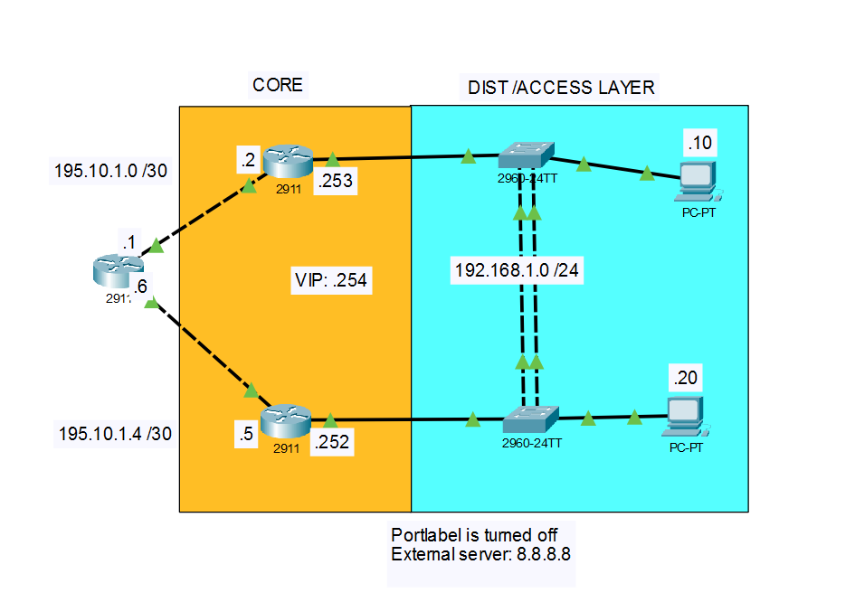

# Implementing Gateway redundancy on a single LAN with HSRP #

This lab demonstrates the implementation of FHRP on a LAN to provide gateway redundancy and eliminate single points of failure and downtime.” 

[Jump to Observation](#observation)


## Topology Overview 
  
*Figure 1.0*  Physical Topology

```
The network topology consists of a core with three routers, a collapsed distribution layer made up of two layer two switches, and two workstations. 
```

## Logical Architecture
|     Link Type    | Network         | IP        | Interface ID |
|------------------|-----------------|-----------|--------------|
|Ethernet  LAN     | 195.10.1.0 /30  | .1  ~ .2  |  G0/0 - G0/1 |
|Ethernet  LAN     | 195.10.1.4 /30  | .5  ~ .6  |  G0/1 - G0/0 |
|Ethernet  LAN     | 192.1.1.0 /24   |.10  ~ .20 |  Fa0/3       |
|Virtrual Interface| 8.8.8.8   /32   | 8.8.8.8   |  loopback0   |
|Virtual IP (VIP)  | 192.1.1.0   /24 |.254       |  G0/0        |
---

## Layer 2 protocols configured on switches
- Rapid Spanning-Tree protocol *(RSTP)*
    - Features Used
        - PortFast
        - BPDU Filter

- EtherChannel
    - PAgP
## Layer 3 protocols configured on routers
- Dynamic Protocols
    - OSPF
    - EIGRP
---
- Static Route
    - Default route
---
- First Hop Redundancy protocol *(FHRP)*
    - Hot Standby Routing Protocol *(HSRP)* 


```
The protocols listed above are configured across the infrastructure to enable efficient frame and packet forwarding within and outside the LAN. HSRP provides uninterrupted gateway availability for outbound traffic, while dynamic routing protocols manage packet forwarding between the LAN and external networks. EtherChannel increases Layer 2 bandwidth, and RSTP ensures a loop‑free topology, allowing frames to be forwarded more efficiently
```
---

## Configurations

`` Interface IP configurations have been ommited ``

- **EtherChannel** _(PAgP)_
    - SW1 & SW2
         ```
        ASW1(config)#interface range fastEthernet 0/1-2
        ASW1(config-if-range)#channel-group 1 mode desirable 
        ASW1(config-if-range)#end
        ```
        
    - Verifying configuration
        ```
        ASW1#
        ASW1#show ether
        ASW1#show etherchannel sum

        -- output ommitted for brevity --
        
        Number of channel-groups in use: 1
        Number of aggregators:           1

        Group  Port-channel  Protocol    Ports
        ------+-------------+-----------+---------------------------------------

        1         Po1(SU)        PAgP        Fa0/1(P) Fa0/2(P) 
        
        ```

- **RSTP** 
    - SW1 & SW2
        ```
        ASW1#
        ASW1#conf t
        Enter configuration commands, one per line.  End with CNTL/Z.
        ASW1(config)#spanning-tree mode pvst 
        ASW1(config)#spanning-tree vlan 1 priority 24576
        ```
    - Verifying RSTP configuration
        ```
        ASW1#
        ASW1# show spanning-tree 
        VLAN0001
        Spanning tree enabled protocol rstp
        Root ID    Priority    24577
             Address     0001.96B9.59D9
             This bridge is the root
             Hello Time  2 sec  Max Age 20 sec  Forward Delay 15 sec

        Bridge ID  Priority    24577  (priority 24576 sys-id-ext 1)
             Address     0001.96B9.59D9
             Hello Time  2 sec  Max Age 20 sec  Forward Delay 15 sec
             Aging Time  20

        Interface        Role Sts Cost      Prio.Nbr Type
        ---------------- ---- --- --------- -------- ---------------------------
        Fa0/3            Desg FWD 19        128.3    P2p
        Gi0/1            Desg FWD 4         128.25   P2p
        Po1              Desg FWD 12        128.27   P2p

        ```
    - Feature configurations
        - SW1 & SW2
            ```
            ASW1(config)#interface FastEthernet0/3
            ASW1(config-if)#spanning-tree portfast
            ASW1(config-if)#spanning-tree bpdufilter enable

            ASW1(config-if)#interface GigabitEthernet0/1
            ASW1(config-if)#spanning-tree portfast
            ```

- **Open Shortest Part First** *(OSPF)*
    - Router1 & Router2
        ```
        R2# conf t
        Enter configuration commands, one per line.  End with CNTL/Z.
        R2(config)#interface GigabitEthernet0/0
        R2(config-if)#ip ospf 1 area 0
        exit
        R2(config)#
        R2(config)#router ospf 1
        R2(config-router)#router-id 2.2.2.2
        R2(config-router)#passive-interface GigabitEthernet0/1
        ```
        
       The passive‑interface command is applied to interfaces connected to EIGRP‑enabled networks

    - Verifying OSPF configuration
        ```
        R2#
        R2#show ip protocols 
        Routing Protocol is "ospf 1"
        Outgoing update filter list for all interfaces is not set 
        Incoming update filter list for all interfaces is not set 
        Router ID 2.2.2.2
        Number of areas in this router is 1. 1 normal 0 stub 0 nssa
         Maximum path: 4
        Routing for Networks:
        Passive Interface(s): 
        GigabitEthernet0/1
        Routing Information Sources:  
        Gateway         Distance      Last Update 
        1.1.1.1              110      00:00:03
        2.2.2.2              110      00:29:58
        Distance: (default is 110)
        ```

- **Enhanced Interior Gateway Protocol** *(EIGRP)*
    - R2 (same application on R1, R3)
        ```
        R2# conf t
        Enter configuration commands, one per line.  End with CNTL/Z.
        R2(config)#router eigrp 1
        R2(config-router)#no auto-summary 
        R2(config-router)#router-id 2.2.2.2 
        R2(config-router)#network 195.10.1.0
        ```
    - Verifying EIGRP configuration
        ```
        R2#show ip eigrp in
        R2#show ip eigrp interfaces 
        IP-EIGRP interfaces for process 1

        Xmit Queue   Mean   Pacing Time   Multicast    Pending
        Interface        Peers  Un/Reliable  SRTT   Un/Reliable   Flow Timer   Routes
        Gig0/1             1        0/0      1236       0/10           0           0
        R2#
        R2#
        ```
        ```
        R2#show ip route e
        R2#show ip route eigrp 
            195.10.1.0/24 is variably subnetted, 3 subnets, 2 masks
        D   195.10.1.4/30 [90/3072] via 195.10.1.1, 06:14:54, GigabitEthernet0/1

        ```
- **Static Route**
    - R1 Same configuration apply to R1 and R3
        ```
        R2# conf t
        Enter configuration commands, one per line.  End with CNTL/Z.
        R2(config)#ip route 0.0.0.0 0.0.0.0 195.10.1.1 
        R2(config)#exit

    - Verifying configuration
        ```    
        R2#
        R2#show ip route st
        R2#show ip route static 
            S*   0.0.0.0/0 [1/0] via 195.10.1.1
        ```

- **External Server configuration**
    - Router 2
        ```
        R3# conf t
        Enter configuration commands, one per line.  End with CNTL/Z.
        R3(config)#
        R3(config)#interface Loopback0
        R3(config-if)#ip address 8.8.8.8 255.255.255.255
        ```

- **Hot Standby Router Protocol** *(HSRP)*
    - Router1 & Router2
        ```
        R1# conf t
        Enter configuration commands, one per line.  End with CNTL/Z.
        R1(config)#
        R1(config)#interface gigabitEthernet 0/0
        R1(config-if)#
        R1(config-if)#standby version 2
        R1(config-if)#standby 1 ip 192.168.1.254 
        R1(config-if)#standby 1 priority 150
        R1(config-if)#standby 1 preempt

        ```


Router 1 is intentionally configured as the active router, with a priority of 150 and preempt enabled so it automatically regains control after recovering from a failure. Router 2 remains in standby mode unless Router 1 becomes unavailable

 -     
    - Verifying HSRP configuration on router 1

        ````
        R1#
        R1#show stan
        R1#show standby br
        R1#show standby brief 
            P indicates configured to preempt.
            |
        Interface   Grp  Pri P State    Active          Standby         Virtual IP
        Gig0/0      1    150 P Active   local           192.168.1.253   192.168.1.254 
        ```

Both PCs in the LAN use the HSRP virtual IP address as their default gateway. The lab concludes by shutting down the active router and verifying connectivity to the external server through continuous pings.

```

Cisco Packet Tracer PC Command Line 1.0
C:\>ping 8.8.8.8

Pinging 8.8.8.8 with 32 bytes of data:

Request timed out.
Reply from 8.8.8.8: bytes=32 time=1ms TTL=254
Reply from 8.8.8.8: bytes=32 time<1ms TTL=254
Reply from 8.8.8.8: bytes=32 time<1ms TTL=254
Ping statistics for 8.8.8.8:
    Packets: Sent = 4, Received = 3, Lost = 1 (50% loss),
Approximate round trip times in milli-seconds:
    Minimum = 0ms, Maximum = 1ms, Average = 0ms

C:\>

```

----

[Jump to Topology Overview](#topology-overview)

# Observation:
While analyzing ICMP traffic to the external server, I noticed that the switch does not store the HSRP virtual MAC address (the multicast MAC associated with the VIP) in its MAC address table. As a result, the switch floods ICMP frames destined for the Default gateway out all ports except the receiving port each time traffic is sent to the VIP.

Running the show mac-address-table command on both switches confirmed that the virtual MAC address is not learned, although the physical MAC addresses of the router connected LAN interfaces are present. Return traffic from the router uses its physical interface MAC address, which is correctly stored in the MAC address table.

Further investigation will be carried out to confirm and better understand this behavior.
Thank you for viewing this lab, I hope you learned something new.


