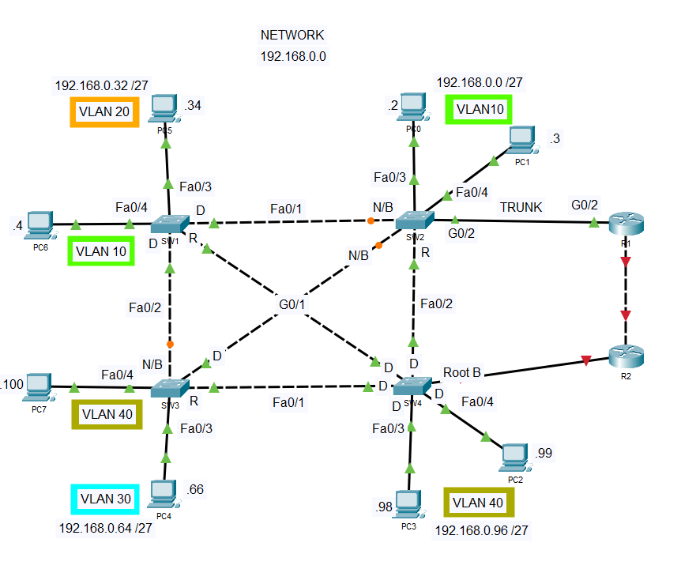
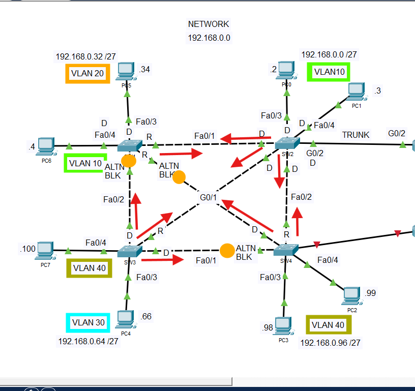
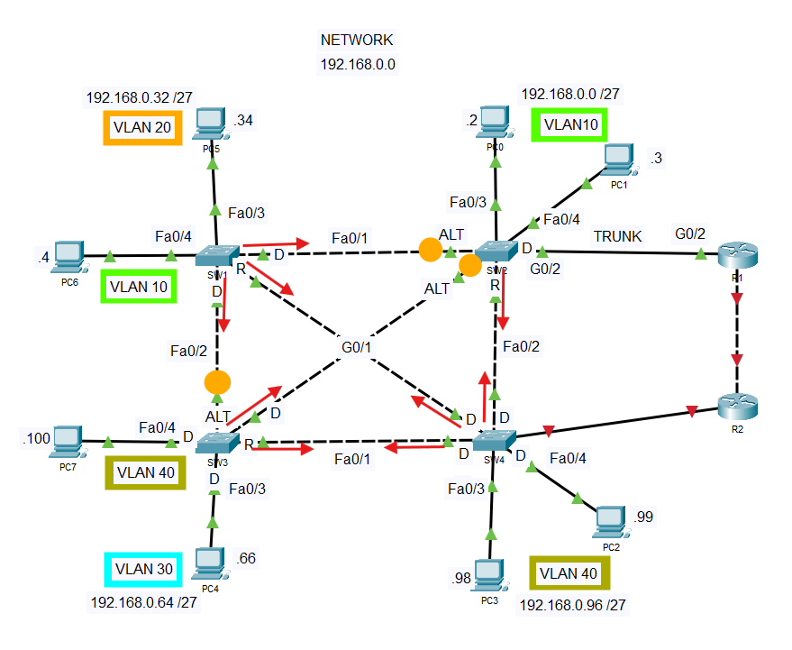

## 📝 **Project Overview**
This lab incoporates several Layer two protocols, namely: VTP protocol, DTP protocol and STP protocol.

Starting initial configuration with VLAN Trunking Protocol. VTP is a Cisco Proprietary Protocol that communicates the definition of Virtual Local Area Network. Switches were respectively confgured as sever and clients. VLANs used in this lab are configured in the Switch on VTP server mode. This increases the VTP revision number. This VLAN information are propagated across other switches removing the need to manually configure the rest of the Switch.

VTP advertisements are sent only over 802.1Q, and ISL trunk ports, therefore all P2P link ports are configured as trunk. the rest of the Switch receives the advertisement and scubcribe to the VTP domain. 

Host ports are configured as access ports with each ports subscribing to a VLAN, However the trunk ports carries VLAN frames from all VLAN (1-1005). VTP V2 allows the extended VLAN range 1006 - 4094 in VTP Transparent mode. Access pots are they configured to use PortFast using the command "Spanning-Tree Portfast" to eliminate the down time from the STP Port States. BPDU gaurd activated on access ports to protect the network from unauthorised, unexpected connections.  

## TABLE OF CONTENT
- Introducting the Rapid Per-Vlan Spanning-Tree (RSTP) IEEE 802.1w
  - Current Physical Topology
  - Configuring the switches mode to Rapid PVST+
  - Configuring VLANS with seperate STP instance
  - Observing the VLANs STP Topology
---

### INTRODUCTING THE RAPID PER VLAN SPANNING-TREE (RPVST+)
Until this moment our topology use classic STP 802.1d, with all VLANs using one instance of STP. In this chapter I will introduce the Rapid PVST+ (RPVST+) a cisco propritary protocol that allows Rapid STP instance per VLAN. 


### Current Physical Topology ###

  
**Figure 1.0** Existing Network Topology with Classic STP 802.1D
---

### Configuring the switches mode to Rapid PVST+

On SW1 - SW4 
``` bash 
SW1(config)#spanning-tree mode rapid-pvst 

```

Verify rstp is configured on switch 
``` bash
SW1#show span

VLAN0001
  Spanning tree enabled protocol rstp
```
spanning tree mode has changed from ieee to rstp on all VLAN on the switches.

`With RPVST mode configured, all switches will send BPDUs from ports on forwarding state. `

RPVST has four (4) ports foles:
- Discarding
- Alt BLK ( _althernate port for root port_ )
- Designated 
- Back BLK ( Backup of designated port ) ( _on segments with multiple shared ports_ )

---

### Configuring VLANS with seperate STP instance

|VLAN(s)  | Primary root switch | Secondary root switch |
|---------|-------------------|-----------------------|
|10, 20  | SW2               | SW4                   |
|30, 40  | SW4               | SW2                   |

SW2
```bash
SW2(config)#
SW2(config)#spanning-tree vlan 10,20 root primary 
SW2(config)#spanning-tree vlan 30,40 root secondary

```
SW4
```bash 
SW4(config)#
SW4(config)#spanning-tree vlan 10,20 root secondary 
SW4(config)#spanning-tree vlan 30,40 root primary 

```
### Observing the VLANs STP Topology
The blocking amber links light are no more present as a link/port could serve as an alternating port for one VLAN and forwarding port to another VLAN. 

### VLAN 10, 20 TOPOLOGY
For VLAN 10, 20 on SW2 is the root bridge, and all ports becomes designated ports and placed on forwarding state.

  
*Figure 2.0* STP Topology for VLAN 10, 20
---


### VLAN 30, 40 TOPOLOGY
  
*Figure 3.0* STP Topology for VLAN 30, 40
---


### Effect of enabling BPDU filter on an interface
It is worth knowing that ports with BPDU filter enabled will not send BPDUs out that interface. In this case, `SW1` has BPDU filter enabled on its `fa0/3` interface. In addition, BPDU guard is enabled by default on global configuration mode. The result of these configuration will also casue SW1 to ignore BPDU received on that interface.`(_for testing sake, a switch is connected to the fa0/3 interface_)` Therefore any switch connected on that link will remain a root bridge becuase it will not receive a superior BPDU from other switches.  

