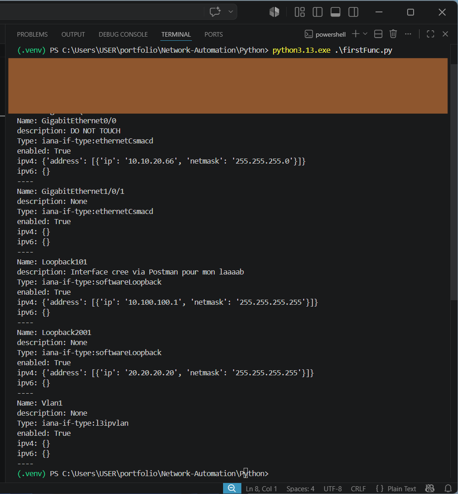

# **Network Automation – RESTCONF Interface Viewer**

This is a small but practical network‑automation project I built to learn how to interact with Cisco IOS‑XE devices using **RESTCONF** and **Python**.  

The script connects to a Cisco sandbox router, pulls interface information in **YANG‑modeled JSON**, and prints only the enabled interfaces in a clean, readable format.

```
It’s a simple project, but it shows the core idea behind network automation:  
**use APIs instead of CLI to collect structured data from network devices.**
```

---

## **What the project does**

The script performs three main tasks:

-  **1. Connects to a Cisco IOS‑XE device via RESTCONF**  
    It sends an authenticated GET request to the router’s RESTCONF API endpoint.

-  **2. Retrieves interface information in JSON format**  
    The device returns structured data based on the `ietf-interfaces` YANG model.

-  **3. Prints only the enabled interfaces**  
For each interface, it displays:

    - Name  
    - Description  
    - Type  
    - Enabled state  
    - IPv4 info  
    - IPv6 info  

This makes it easy to quickly see which interfaces are active and how they’re configured.

## **Running the python script** 
  

---

## **Project Structure**

```
project/
│
├── info.py              # Stores USERNAME, PASSWORD, URL (not uploaded)
├── firstFunc.py         # Main script (your code)
├── requirements.txt     # Python dependencies
└── .gitignore           # Hides secrets and local files
```

You should not upload your `info.py` file. it is intentionally excluded from GitHub using `.gitignore` so your credentials stay private.

---

## **How the script works (functions explained)**

### **`printInterfaces()`**  
- Makes the RESTCONF GET request  
- Converts the response to JSON  
- Passes the data to the formatter function  
- Handles errors gracefully  

### **`printREsult(result)`**  
- Extracts the interface list from the JSON  
- Loops through each interface  
- Prints only the ones where `enabled == True`  
- Formats the output so it’s easy to read  

### **Main block**  
Runs the script only when executed directly.

---

## **Libraries I Used**

Only two external libraries are required:

- **requests** – for making REST API calls  
- **urllib3** (optional) – to suppress SSL warnings  

Everything else (`sys`, `json`, etc.) is part of Python’s standard library.
Your `requirements.txt` includes:

```
requests
```

---

## **Device used (Cisco DevNet Sandbox)**

This project uses the **Cisco IOS‑XE Always‑On Sandbox**, which is publicly available for testing automation:

- Model: **Cisco Catalyst 9000 (IOS‑XE)**
- API: **RESTCONF**
- YANG models: `ietf-interfaces`, `ietf-ip`, `Cisco-IOS-XE-native`, etc.

The sandbox provides a stable environment for learning:


## **How to run it**

1. Clone the repo  
2. Create a virtual environment  
3. Install dependencies:

```
pip install -r requirements.txt
```

4. Create your own `info.py` file:

```python
USERNAME = "your_username"
PASSWORD = "your_password"
URL = "https://sandbox-url/restconf/data/ietf-interfaces:interfaces"
```

5. Run the script:

```
python <your file name>
```

---


##  **Future improvements I would be interested to add**


- Export interface data to CSV  
- Add colorized output  
- Add IPv4/IPv6 address extraction  
- Build a small dashboard (Flask or Streamlit)  
- Add support for NETCONF  

---