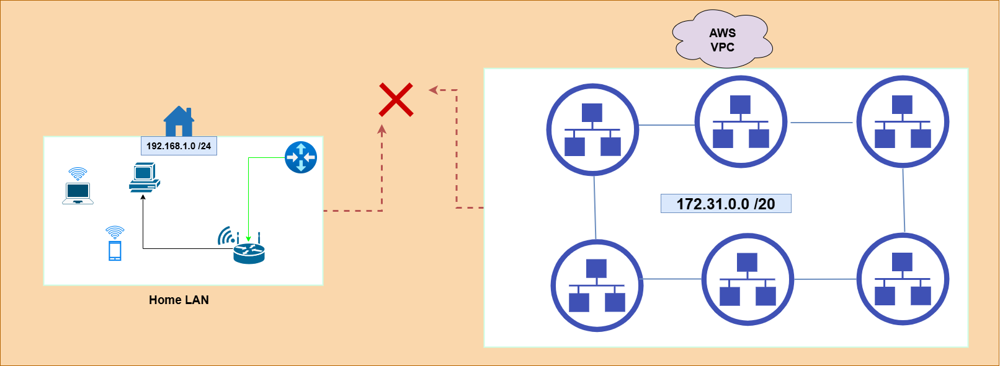
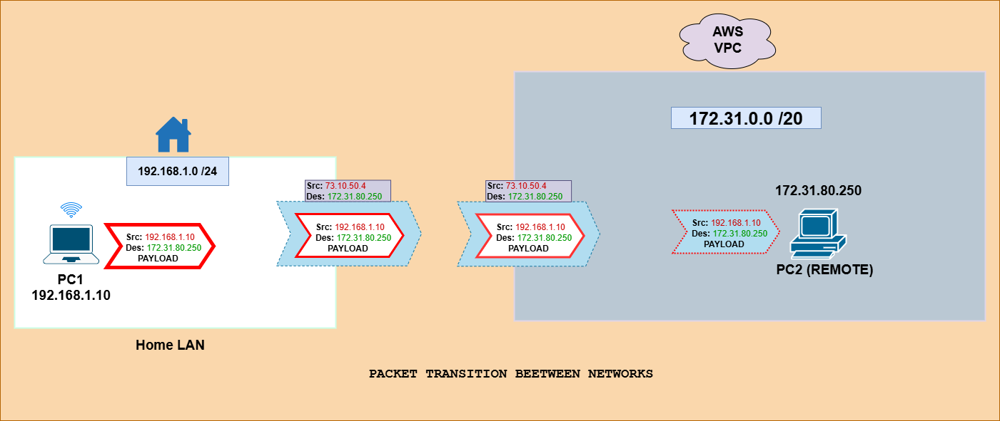
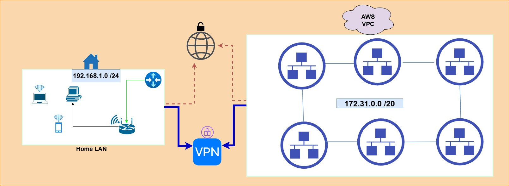

# SITE-TO-SITE CONNECTION WITH VPN TUNNEL
[Author](inkedin.com/in/collins-amalimeh/): Collins Chinedu Amalimeh.
 

## TABLE OF CONTENTS
-  [Site-to-Site Topology](#site-to-site-topology)
-  [Project Overview](#project-overview)
-  [Choosing a VPN](#choosing-a-vpn)
     -  [How wireguard VPN works](#how-wireguard-vpn-works)
    -   [Step‑by‑Step Wireguard Installation and Implementation](#stepbystep-wireguard-installation-and-implementation)
    -   [Testing Tunnel connectivity between sites](#testing-tunnel-connectivity-between-sites) 
-   [What Next](#what-next)
-   [Reources](#resources-used)

---
### SITE-TO-SITE TOPOLOGY 
**Figure 1.0** - Two physically separated networks

The topology diagram shows two logically and `geographically separated networks`. Under normal circumstances, these networks cannot share resources because private IP addresses are not routable over the public internet.

For enterprises with branches or sites in different locations, this creates a natural barrier to seamless communication and resource sharing. To overcome this limitation and enable secure, reliable access between remote networks, organizations use VPN tunnels. `A Site‑to‑Site VPN allows these isolated networks to operate as if they were part of the same internal infrastructure`. Many enterprises also require employees to connect through a VPN before accessing internal resources, ensuring security while removing the constraints of physical separation.

---
###  PROJECT OVERVIEW.

This is a `Site‑to‑Site` VPN tunnel project to connect an `on‑premises` infrastructure to a `Virtual Private Cloud` _(AWS VPC)_. This allows both geographically separated networks to operate as one, with the added benefits of secure data exchange and shared access to resources.

In this project, the on‑premises site _(Site PVE)_ is my home network, which consists of a single LAN. The VPC environment _(Site AWS)_ contains six LANs, but for this specific implementation, the VPN tunnel only connects one designated host in one of the VPC LAN to a host _(Proxmox VM)_ in my Home network _(Site PVE)_.

---
### CHOOSING A VPN
For this project, I chose to use the [`WireGuard VPN`](https://www.wireguard.com/). It is an open‑source tunneling protocol designed for simplicity, speed, and strong security. It supports Site‑to‑Site VPN configurations and is known for being lightweight because it uses minimal overhead and relies on the UDP transport protocol for fast data transmission.

Compared to other VPN solutions like IPsec or OpenVPN, WireGuard is easier to implement and maintain. It also provides enterprise‑grade encryption using the modern [`ChaCha20`](http://cr.yp.to/chacha.html) cipher suite. Read more about wireguard [here](https://www.wireguard.com/)

---
- #### How wireguard VPN works
WireGuard operates by creating a virtual network interface (such as wg0, wg1, etc.). This interface is configured to allow traffic only from a specific set of IP addresses. That set of allowed IPs effectively defines the tunnel. In this scenario, any packet destined for `>` or originating from `<` the remote site is routed through this WireGuard interface.

When a packet enters the tunnel, WireGuard encrypts it using the peer’s public key. The encrypted packet is then encapsulated inside an outer packet that contains the public IP address of the source network and the public IP address of the destination network. This outer layer allows the encrypted traffic to travel across the internet.

On the remote site, WireGuard removes the outer encapsulation, revealing the encrypted inner packet. It then decrypts that packet using its private key and forwards it to the appropriate host based on the private IP address and specified port.

> It’s important to note that only IP addresses explicitly listed in the configuration file are allowed through the tunnel. Any traffic outside the defined AllowedIPs will not be routed or accepted.

---
**Figure 2.0** - Data Encapsulation Through the Tunnel

In the diagram above **Figure 2.0**, you can visualize how traffic moving between the two networks is encapsulated and de‑encapsulated as it travels through the VPN tunnel. When data leaves its native network, WireGuard wraps the private‑IP packet inside an encrypted outer packet suitable for transmission over the public internet.

Upon arrival at the remote site, that outer layer is removed, the encrypted payload is decrypted, and the original private‑IP packet is delivered to the appropriate host on the destination network. 

---
- #### Step‑by‑Step Wireguard Installation and Implementation. 

> You can follow the full step‑by‑step installation and configuration of WireGuard on both sites in the dedicated implementation guide [here](./configs/wireguard-vpn/README.md). This includes generating keys, configuring interfaces, defining AllowedIPs, configuring ACLs, Port forwarding, and validating tunnel connectivity. 

---
- #### Testing tunnel connectivity between sites
To complete the implementation, I tested WireGuard connectivity between both sites. The most reliable way to confirm this is by pinging a host on the Proxmox site using its private IP address. Receiving echo replies from the ping verifies that traffic is now flowing in both directions and that the two sites are successfully connected through the WireGuard tunnel.

**Figure 3.0** - A secure Tunnel path over the Internet
 

**Figure 3.0** - (Video) Demo Testing The Tunnel
>

---

- ### What Next
>
With the experience gained from this project, I plan to continue expanding my home‑lab environment by deploying and configuring pfSense on my home LAN. This will allow me to host and manage multiple resources across different subnets and further strengthen my understanding of network segmentation and firewall management. [Jump back up](#table-of-contents)

> Date Completed: 2nd April, 2026 
---

---

-   ### Resources Used
About WireGuard
https://www.wireguard.com/

wireguard installation
https://www.wireguard.com/install/

Others:
> 
https://ubuntu.com/server/docs/how-to/wireguard-vpn/site-to-site/#wireguard-vpn-site-to-site

https://www.geeksforgeeks.org/git/how-to-embed-a-video-into-github-readme-md/

https://ubuntu.com/server/docs/explanation/intro-to/wireguard-vpn/

https://www.wireguard.com/netns/

https://www.wireguard.com/quickstart/
https://www.geeksforgeeks.org/linux-unix/iptables-command-in-linux-with-examples/