# STEP BY STEP WIREGUARD INSTALLATION AND IMPLEMENTATION
[Author](inkedin.com/in/collins-amalimeh/): Collins Chinedu Amalimeh.


## TABLE OF CONTENTS
-  [Installation and Configuration Overview](#installation-and-configuration-overview)
-   [Step-by-Step Implementation](#step-by-step-implementation)
    -   [Downloading Wireguard](#Downloading-Wireguard)
    -   [Verifying WireGuard Installation with Systemd](#verifying-wireguard-installation-with-systemd)
    -   [Creating the WireGuard Configuration File](#creating-the-wireguard-configuration-file)
    -   [Updating WireGuard Configuration File Permissions](#updating-wireguard-configuration-file-permissions)
    -   [ Generating Private and Public Encryption Keys for the PVE Site](#generating-private-and-public-encryption-keys-for-the-pve-site)
    -   [Configure and View Private and Public Encryption Keys for the AWS Site](#configure-and-view-private-and-public-encryption-keys-for-the-aws-site)
    -   [Opening and Configuring the WireGuard Configuration File](#opening-and-configuring-the-wireguard-configuration-file)
    -   [WireGuard Configuration Attribute Breakdown](#wireguard-configuration-attribute-breakdown)
    -   [Bringing the Tunnel Interface Up Enabling Auto‑Start with Systemd](#bringing-the-tunnel-interface-up-checking-interface-status-and-enabling-autostart-with-systemd)
    -   [Configuring Port Forwarding on the Default Gateway at the PVE Site](#configuring-port-forwarding-on-the-default-gateway-at-the-pve-site)
    -   [Configuring Port Forwarding on the Default Gateway at the PVE Site](#configuring-port-forwarding-on-the-default-gateway-at-the-pve-site)
    -   [Configuring ACLs And Security gruop](#configuring-acls-and-security-gruop)
    -   [Verifying WireGuard Interface Traffic](#verifying-wireguard-interface-traffic)
    -   [The Ping Test Between Sites](../../README.md)


---
### Installation and Configuration Overview
The host on my home network (Site PVE) runs inside a Proxmox Virtual Environment, while the remote host resides in a single LAN within an AWS Virtual Private Cloud (VPC). Both hosts use the same WireGuard configuration approach.

For this project, I’ll walk through the configuration steps on one host, but the full configuration files for both hosts will be available. A separate page will cover [how to set up an AWS VPC](../../) and [how to deploy Proxmox VE](../../) as well as necessary configuration on both ends.

For now, the focus is on installing and configuring the WireGuard VPN. 


---
## Step-by-Step Implementation:
WireGuard is installed and configured on both sites using a user account with root privileges. The host on `Site PVE` runs on an Ubuntu VM inside Proxmox, while the remote host `AWS Site` in the AWS environment runs on Amazon Linux (t2 instance).

Both machines follow the same overall configuration process, but for clarity, this guide will walk through the steps on a single host. Full configuration files for both hosts will be provided.


---
- ### Downloading Wireguard
```
$ sudo apt install wiregaurd
```
**Figure 1.0** - Installing wireguard
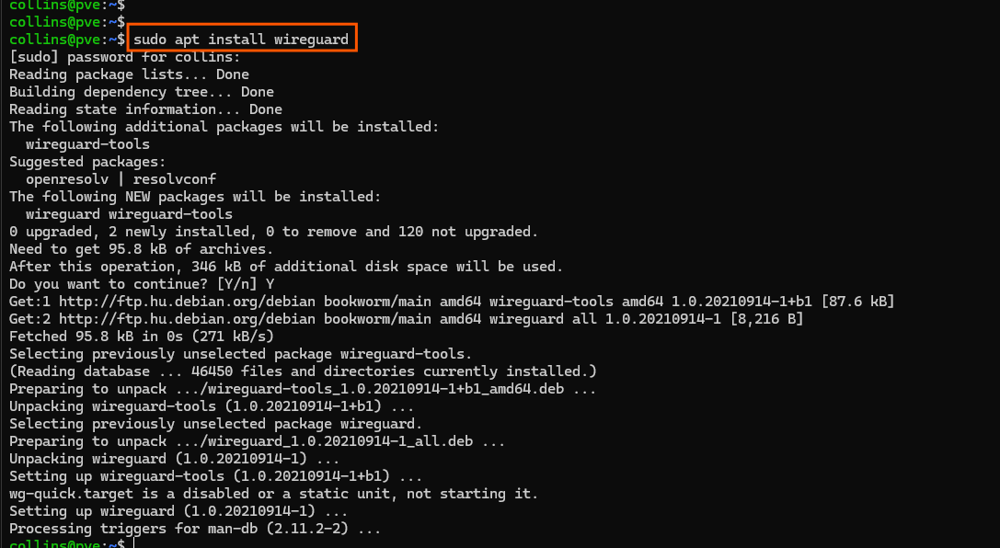


---
- ### Verifying WireGuard Installation with Systemd
```
$ sudo systemctl status wg-quick@wg0
```
**Figure 2.0** - Confirming installation of wireguard
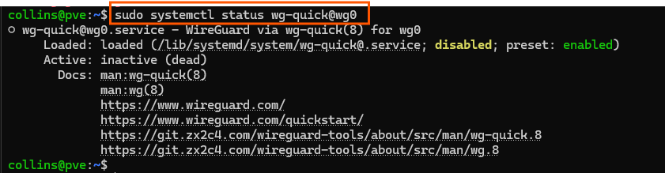
WireGuard is successfully installed, but is currently inactive because it has not been started or enabled yet. After we finish configuring the WireGuard interface file with the tunnel parameters, we will use systemd to start and enable the WireGuard interface so the tunnel comes up automatically.


---
- ### Creating the WireGuard Configuration File
By default, WireGuard does not create a configuration file during installation. We need to create one manually at `/etc/wireguard/`. After creating the file, we can verify that it exists and proceed with adding the tunnel configuration.

```
$ sudo touch /etc/wireguard/wg0.conf 
$ sudo ls -l /etc/wireguard/
```

**Figure 3.0** - Viewing wireguard file
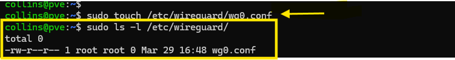

---

-  ### Updating WireGuard Configuration File Permissions

For security, the WireGuard configuration file should only be readable by root. This prevents unauthorized users from accessing private keys or tunnel details. We will update the file permissions so that only the owner (root) has access.

```
$ sudo chmod o-r /etc/wireguard/wg0.conf
```

**Figure 4.0** - Changing file permission
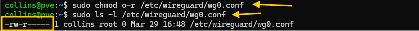

---

 - ### Generating Private and Public Encryption Keys for the PVE Site

In my home directory, I created a dedicated folder named `wireguard/` to store the generated WireGuard private and public keys. On the AWS host, the keys are stored in a similar directory named `vpn` inside the user’s home directory.

```
$ wg genkey | sudo tee /wireguard/pve.key
$ cat wireguard/pve.key | wg pubkey | tee wireguard/pve.pub
$ sudo chown root:collins wireguard/pve.key wireguard/pve.pub
$ sudo chmod g+rw wireguard/pve.key wireguard/pve.pub
```
- **Verify the file exist**
```
$ lf wireguard/
```
**Figure 5.0** - Viewing created key files
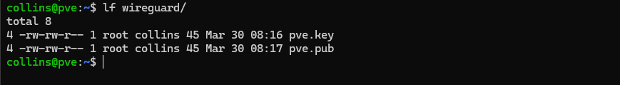

The command `lf` is an alias for `ls -l1`. (Ajust file permission).

> **Note:** You can name the key files however you prefer, as long as you use the correct extensions.


`.key` for the private key

`.pub` for the public key

This keeps the key pairs organized and makes it easy to reference them when configuring the WireGuard interface.


---
 - ### Configure and View Private and Public Encryption Keys for the AWS Site

```
$ wg genkey | sudo tee aws.key
$ cat aws.key | wg pubkey | tee aws.pub
$ chown root: aws.key aws.pub
$ sudo chmod o-r aws.key aws.pub
```

**Figure 6.0** - Viewing created key files
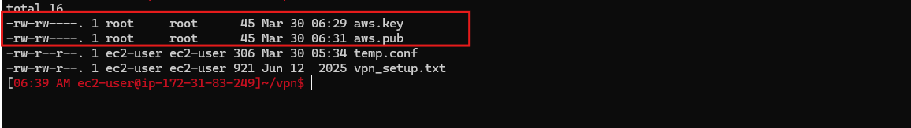


---
- ### Opening and Configuring the WireGuard Configuration File

Now that I have generated the encryption keys, I will configure the config file. Use `nano` (or any preferred text editor) with sudo to open the [configuration file](./pve-wg0.conf). The file has already been pre‑configured with the necessary tunnel parameters. It can be viewed or downloaded below and customized to match your project setup.
```
$ sudo nano /etc/wireguard/wg0.conf
```

For PVE Site: [view](/configs/wireguard-vpn/wg0.conf)
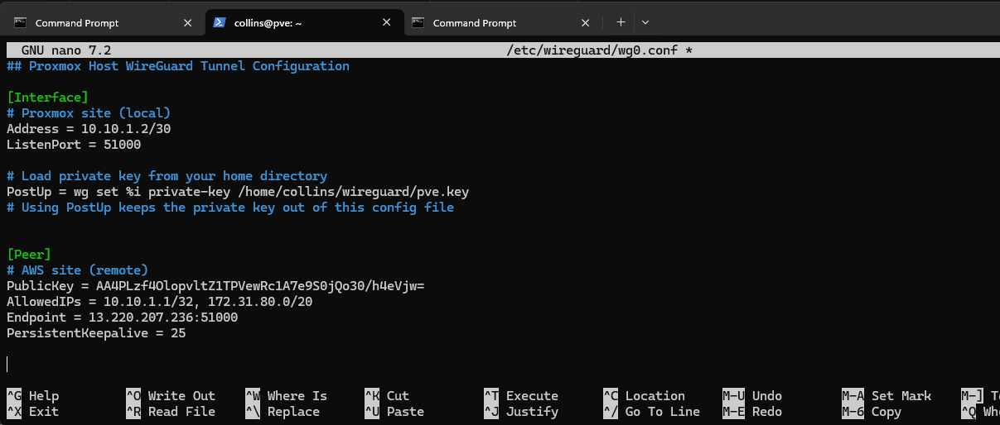


For AWS Site: [view](/configs/wireguard-vpn/wg0.conf)
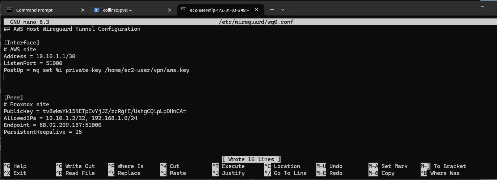

---
- ### WireGuard Configuration Attribute Breakdown

**Table 1.0:**  Attributes and Their Meaning
| **Attribute** | **Value** | **Meaning / Purpose** |
| --- | --- | --- |
| ``Address`` | ``10.10.1.1/30`` | The WireGuard interface IP for the AWS host. Defines the tunnel network range. |
| ``ListenPort`` | ``51000`` | The UDP port WireGuard listens on for incoming encrypted packets. |
| ``PostUp`` | ``wg ``set ``%i `` private-key ``/home/ec2-user/vpn/aws.key`` | Command executed after the interface starts. Loads the private key for this WireGuard interface from the specified directory. |
| ``PublicKey`` | ``location to/pve/public/key>`` | The public key of the Proxmox peer. Used to encrypt traffic sent to that peer. |
| ``AllowedIPs`` | ``10.10.1.2/32,`` ``192.168.1.0/24`` | Defines which IPs should be routed through the tunnel. Includes the remote tunnel interface IP and the remote LAN subnet. |
| ``Endpoint`` | ``88.92.209.167:51000`` | Public IP and port of the Proxmox site. WireGuard sends encrypted packets to this address on this port number. |
| ``PersistentKeepalive`` | ``25`` | Sends a keepalive packet every 25 seconds to maintain NAT mappings and keep the tunnel active. |

---

- ### Bringing the Tunnel Interface Up, Checking Interface Status, and Enabling Auto‑Start with Systemd

After configuring the interface, I bring it up using the `sudo wg-quick up wg0` command, which also loads the configuration file. I then verify the tunnel status with `sudo wg show`. Once the interface is confirmed to be running, I enable the WireGuard service so it starts automatically on system boot. Finally, I verify that the tunnel interface has been added to the VM’s network stack.

**Figure 6.0** - Bringing Tunnel interface up
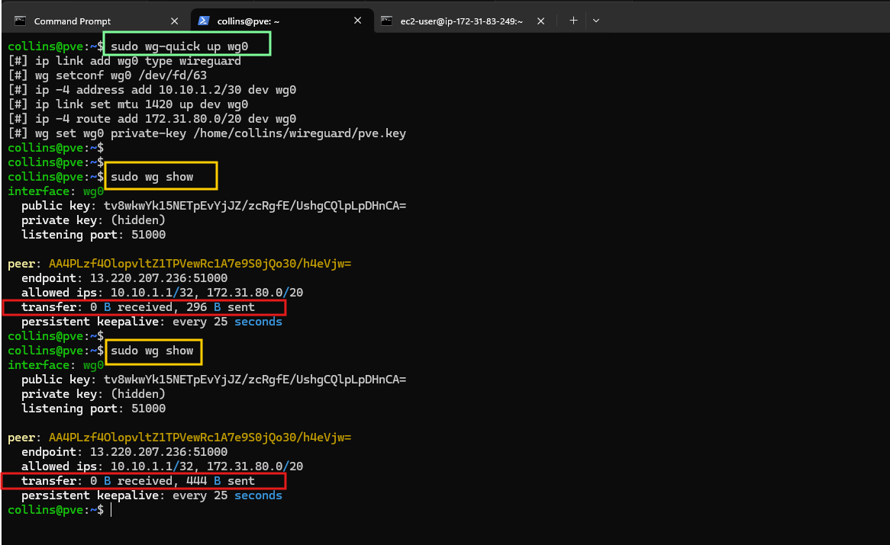

After bringing the interface up as shown in Figure 6.0, you can see that the tunnel is sending keepalive packets but not receiving any traffic. This happens because port forwarding has not yet been configured on my home router. In addition, my remote AWS VPC ACL must be updated to allow inbound and outbound UDP traffic on the configured WireGuard port. Until both the home router and the AWS ACL permit this traffic, the tunnel will remain one‑way.

**Figure 7.0** - Verifying Tunnel interface (PVE Host)
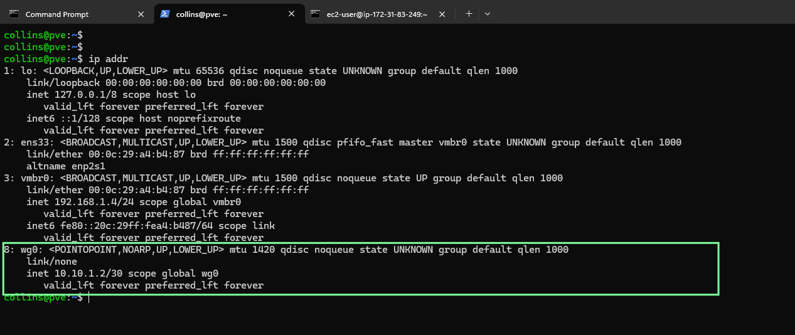

**Figure 8.0** - Verifying Tunnel interface (AWS VPC Host)
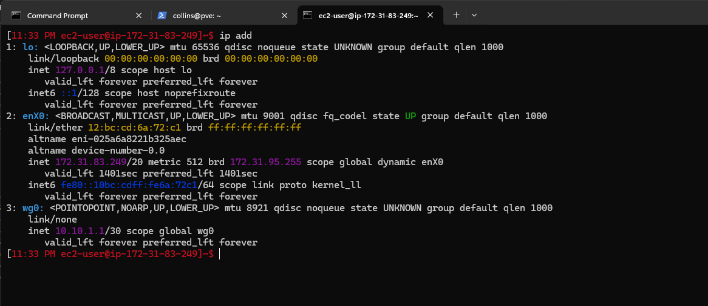

After reviewing Figure 7.0, we can confirm that the WireGuard tunnel interface has been successfully added to the system’s network stack with the specified IP address and mask `10.10.1.2 /30` and `10.10.1.1 /30`. The next step is to configure port forwarding on the Proxmox‑site home router and update the Network ACLs in the AWS VPC to allow inbound and outbound UDP traffic on the WireGuard port.
> Once both the router NAT rule and the AWS ACL entries are in place, I will recheck the tunnel traffic to verify that bidirectional communication is established.


---
- ### Configuring Port Forwarding on the Default Gateway at the PVE Site

**Figure 9.0** - Router's Interface
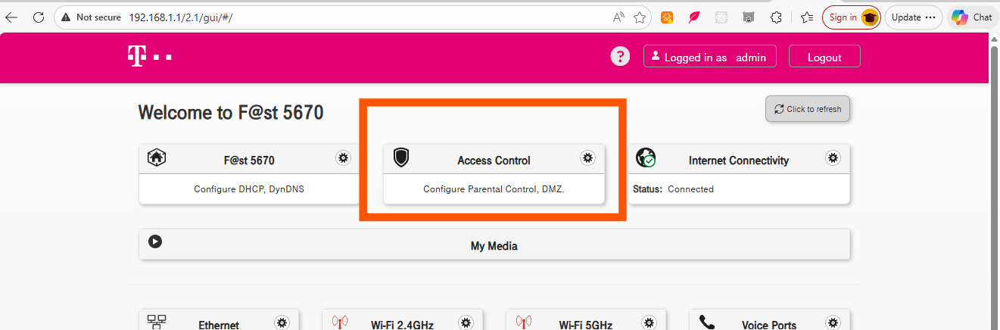
**Figure 10.0** - Configuring Port Forwarding and ACLs
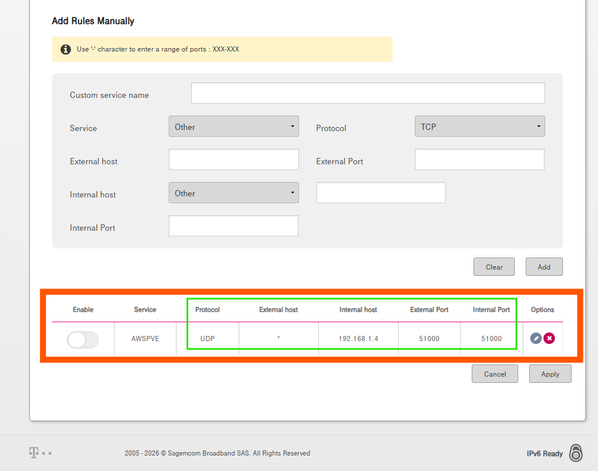

In the router’s Access List, I configured the required port‑forwarding rule. Ideally, it is more secure to restrict the open port to trusted external IP addresses only. However, for this demonstration, the port is open to all external hosts, indicated by the asterisk `*` in the External Host field. Any traffic arriving on this port is forwarded directly to the Proxmox host.

The next step is to configure the Network ACLs and Security Groups on the AWS site to allow inbound and outbound UDP traffic on the WireGuard port. Once these rules are applied, I will verify the tunnel traffic again.

---

- ### Configuring ACLs And Security gruop

To implement effective firewall rules, it’s important to understand the difference between Network ACLs and Security Groups. ACLs operate at the subnet level, functioning as stateless firewall rules on the network boundary. Security Groups, on the other hand, act as stateful firewalls applied directly to the instance or its network interface.

If a Network ACL blocks HTTP traffic to a subnet, none of the hosts in that subnet will receive HTTP requests, even if their Security Groups allow it. Conversely, if the ACL permits the traffic but the instance’s Security Group does not, the host will still reject the connection. This layered approach provides flexibility, allowing you to control traffic both at the network perimeter and at the individual host level depending on the services they expose.

**Figure 11.0** - Adding an Inbound Security Group Rule
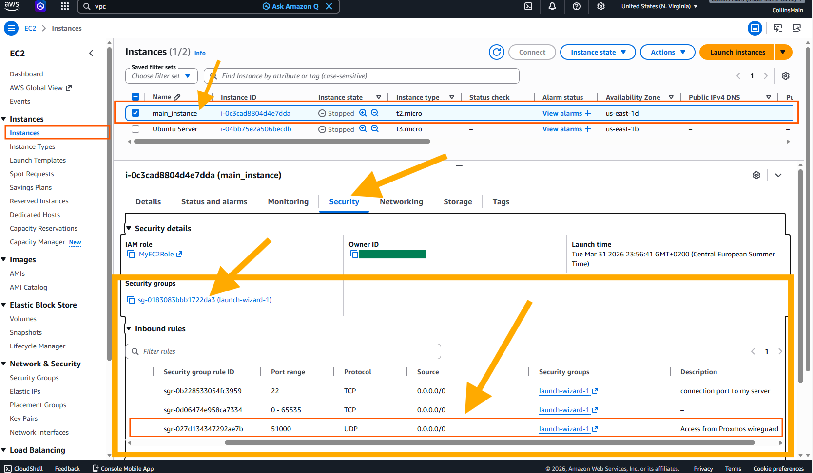

> At the instance‑interface level, I added an inbound Security Group rule allowing UDP traffic on port 51000. This ensures that the WireGuard packets forwarded from the home router can reach the AWS instance once they pass through the VPC’s Network ACLs.

**Figure 11.0** - Adding an Inbound ACL Rule
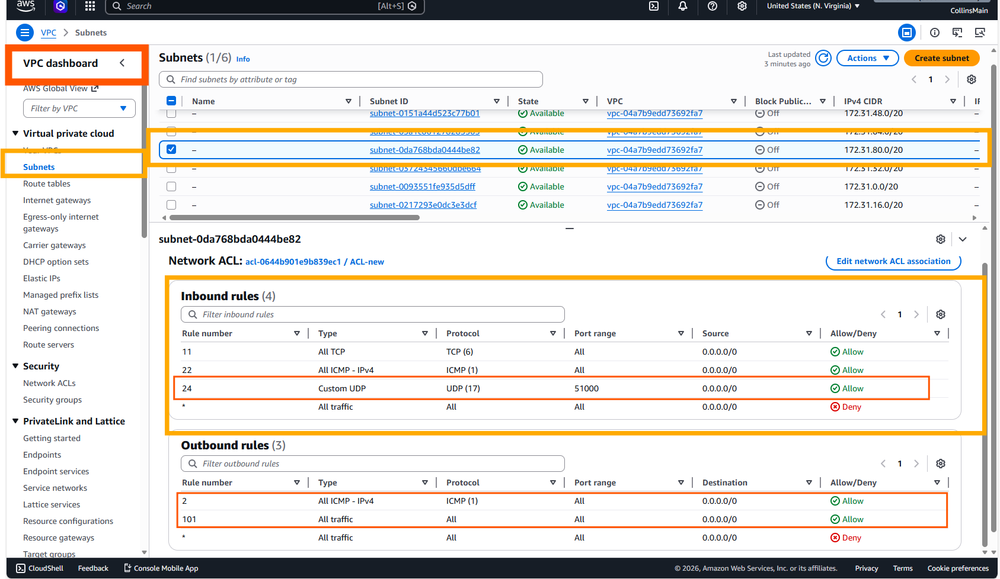

At the subnet and gateway level, I added an inbound Network ACL rule allowing UDP traffic on port `51000`. By default, outbound traffic is permitted unless explicitly denied, so no additional outbound rule was required. This ACL entry ensures that WireGuard packets can enter the subnet before being evaluated by the instance‑level Security Group.


---

- ### Verifying WireGuard Interface Traffic
One of the first ways to confirm connectivity between both sites is by checking the keepalive traffic on the WireGuard interface. Earlier in the setup, the interface was able to send keepalive packets but could not receive any. This was expected because port forwarding had not yet been configured on the PVE‑site router, and the AWS‑side Network ACLs and Security Groups were not allowing inbound UDP traffic on the WireGuard port. Once these rules were properly configured, the interface began receiving packets, confirming that bidirectional communication was established.

**Figure 12.0** - Traffic on wireguard interface (PVE Site)
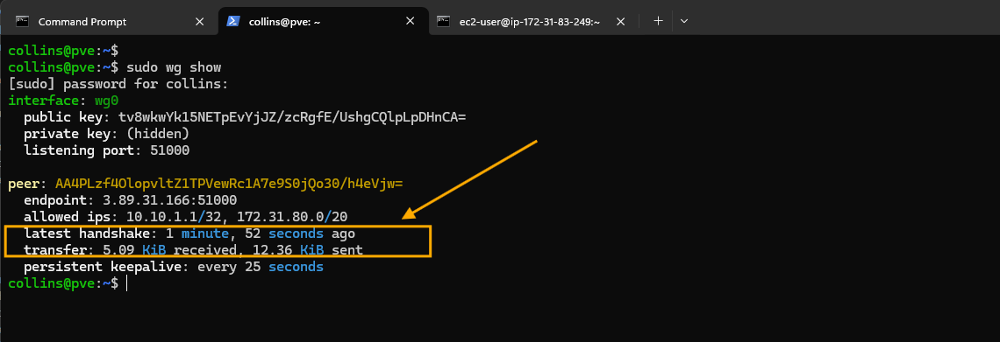

**Figure 13.0** - Traffic on wireguard interface (AWS Site)
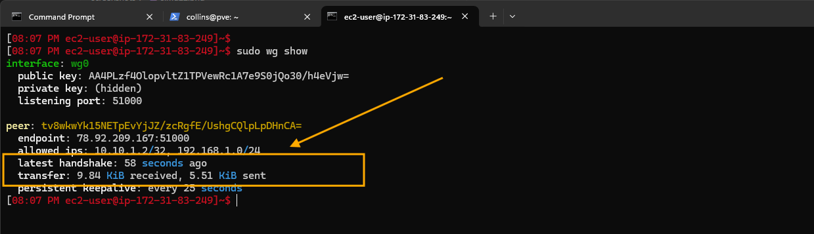


> As show in figure 12 and 13, I highlighted the key areas that confirm the successful handshake and connectivity between both sites. The WireGuard interfaces are now exchanging packets, indicating that the tunnel is fully operational.

---

---
[`Go back to where you came >`](../../README.md)