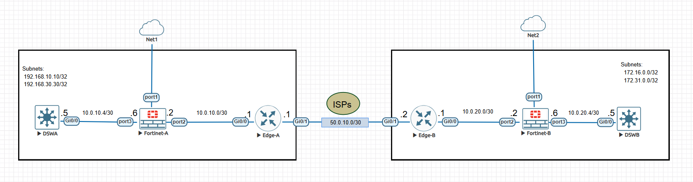
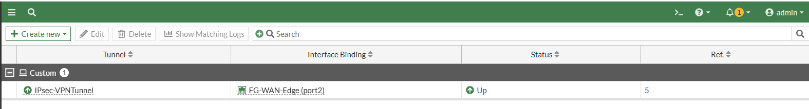
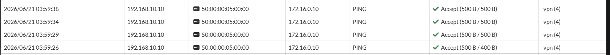

# Cross-Site IPsec VPN Overlay over Private WAN Links

**Author:** Collins C. Amalimeh  
**Objective:** Implementation of a cross-site VPN overlay using IPsec on a Fortinet Firewall to enforce a Zero Trust Security model over an isolated private WAN infrastructure.

---

## Project Overview

This project demonstrates the configuration of secure, cross-site VPN connectivity using IPsec tunnels on Fortigate firewalls. By layering an encrypted overlay on top of private WAN connections, this architecture ensures data confidentiality, payload integrity, and comprehensive peer authentication.

### Key Objectives
* **Secure Private Reachability:** Establish an encrypted, private tunnel between geographically disparate enterprise networks.
* **Seamless Resource Sharing:** Facilitate seamless, secure communications between distinct enterprise sites.
* **Zero Trust Enforcement:** Mitigate risks associated with carrier-level vulnerabilities or misconfigurations by encrypting transit data prior to leaving the enterprise perimeter.

---

## Network Architecture & Design

### Topology Overview


The lab uses a single-homed network topology where the FortiGate firewall sits securely behind an edge router at both sites.

### IP Addressing Scheme
Internal Local Area Networks (LANs) and point-to-point links utilize isolated private IP spaces tailored to the enterprise requirements.

#### Headquarters (HQ) Prefixes
* **Loopback 10 (LAN 1):** `192.168.10.10/32`
* **Loopback 20 (LAN 2):** `192.168.30.30/32`
* **Uplink Network (To Edge):** `10.0.10.0/30`
* **Downlink Network (Internal):** `10.0.10.4/30`

#### Branch Office Prefixes
* **Loopback 10 (LAN 1):** `172.16.0.10/32`
* **Loopback 20 (LAN 2):** `172.31.0.10/32`
* **Uplink Network (To Edge):** `10.0.20.0/30`
* **Downlink Network (Internal):** `10.0.20.4/30`

#### Public / Core Simulation Network
* **WAN Core Interconnect:** `50.0.10.0/30`

---

## Implementation Approach

1. **Topology Planning:** Defined the single-homed boundary structure to properly scope down internal prefixes versus external carrier networks.
2. **Infrastructure Assembly:** Provisioned and interconnected the network endpoints, routing engines, and FortiGate appliances.
3. **IP Subnet Assignment:** Addressed the internal loopback paths on core distribution switches, followed by point-to-point segment links and external WAN paths.
4. **Dynamic Routing Setup:** Deployed **OSPF** for autonomous interior gateway routing and **BGP** across external edge interfaces. OSPF and BGP boundaries utilize mutual redistribution to achieve end-to-end routing awareness.

---

## Device Configurations

### 1. Interior Routing (OSPF)
The CLI configuration below establishes the internal OSPF areas and includes static route redistribution to propagate infrastructure paths:

```
config router ospf
    set router-id 2.2.2.2
    config area
        edit 0.0.0.0
        next
    end
    config ospf-interface
        edit "LAN-port3"
            set interface "port3"
            set ip 10.0.10.6
            set prefix-length 30
            set cost 1
            set dead-interval 40
            set hello-interval 10
            set network-type point-to-point
        next
        edit "FG-WAN-Edge"
            set interface "port2"
            set ip 10.0.10.2
            set prefix-length 30
            set cost 1
            set dead-interval 40
            set hello-interval 10
            set network-type point-to-point
        next
    end
    config network
        edit 1
            set prefix 10.0.10.4 255.255.255.252
        next
        edit 2
            set prefix 10.0.10.0 255.255.255.252
        next
    end
    config redistribute "static"
        set status enable
    end
end

```

Note: To guarantee complete infrastructure reachability across boundaries, ensure mutual redistribution is configured between the OSPF internal process and the BGP edge processes.

2. IPsec VPN Tunnel Configuration
Phase 1 (Gateway Parameters)
Defines the secure key exchange mechanisms, remote peers, and cryptographic primitives:

```
config vpn ipsec phase1-interface
    edit "IPsec-VPNTunnel"
        set interface "port2"
        set local-gw 10.0.10.2
        set peertype any
        set net-device disable
        set proposal des-sha256
        set dhgrp 14
        set remote-gw 10.0.20.2
        set psksecret ENC <passkey>
        set comments "LocalA to REMOTE B"
    next
end
```
Phase 2 (Security Associations / Data Selectors)
Maps out the specific source and destination subnets allowed to pass through the encrypted tunnel:

```
config vpn ipsec phase2-interface
    edit "RemoteFirst"
        set phase1name "IPsec-VPNTunnel"
        set proposal des-sha256
        set dhgrp 14
        set src-subnet 192.168.10.10 255.255.255.255
        set dst-subnet 172.16.0.10 255.255.255.255
        set comments "Primary LAN Interconnect"
    next
    edit "others"
        set phase1name "IPsec-VPNTunnel"
        set proposal des-sha256
        set dhgrp 14
        set src-subnet 192.168.30.30 255.255.255.255
        set dst-subnet 172.31.0.10 255.255.255.255
        set comments "Secondary LAN Interconnect"
    next
end
```

3. Static Overlay Routing
Static routes direct target-bound traffic over the virtual IPsec interface:

```
config router static
    edit 10
        set dst 172.16.0.10 255.255.255.255
        set device "IPsec-VPNTunnel"
    next
    edit 11
        set dst 172.31.0.10 255.255.255.255
        set device "IPsec-VPNTunnel"
    next
end
```

4. Firewall Access Control Policies
Security policies permit bi-directional traffic flow between the secure local networks and the IPsec overlay tunnel:

```
config firewall policy
    edit 2
        set name "allow_LAN_to_Edge"
        set srcintf "port3"
        set dstintf "port2"
        set srcaddr "all"
        set dstaddr "all"
        set action accept
        set schedule "always"
        set service "ALL"
        set logtraffic all
    next
    edit 3
        set name "Edge_to_LAN"
        set srcintf "port2"
        set dstintf "port3"
        set srcaddr "all"
        set dstaddr "all"
        set action accept
        set schedule "always"
        set service "ALL"
        set logtraffic all
        set comments "Edge router to internal LAN"
    next
    edit 4
        set name "LAN_to_VPN_Overlay"
        set srcintf "port3"
        set dstintf "IPsec-VPNTunnel"
        set srcaddr "all"
        set dstaddr "all"
        set action accept
        set schedule "always"
        set service "ALL"
        set logtraffic all
    next
end
```

Verification & Testing
Tunnel Status Verification
Run the following operational command on the FortiGate CLI to confirm that both Phase 1 and Phase 2 negotiations are established:

```
Fortinet-A # diagnose vpn ike gateway list 

vd: root/0
name: IPsec-VPNTunnel
version: 1
interface: port2 4
addr: 10.0.10.2:500 -> 10.0.20.2:500
tun_id: 10.0.20.2/::10.0.20.2
transport: UDP
created: 6909s ago
peer-id: 10.0.20.2
IKE SA: created 1/3  established 1/3  time 10/26/40 ms
IPsec SA: created 1/2  established 1/2  time 20/25/30 ms

  id/spi: 68 8c982d360e4920f4/55f725e195322e5b
  direction: responder
  status: established 4113-4113s ago
  proposal: des-sha256
  lifetime/rekey: 86400/82016
  peer-id: 10.0.20.2
  ```

VPN interface status on fortigate



VPN log status on fortigate



End-to-End Connectivity Test
Execute a standard ICMP ping test sourced from the HQ distribution switch targeting the remote branch subnet to confirm complete overlay reachability:
```
DSWA# ping 172.16.0.10 source 192.168.10.10
Type escape sequence to abort.
Sending 5, 100-byte ICMP Echos to 172.16.0.10, timeout is 2 seconds:
Packet sent with a source address of 192.168.10.10 
!!!!!
Success rate is 100 percent (5/5), round-trip min/avg/max = 9/16/24 ms
```

