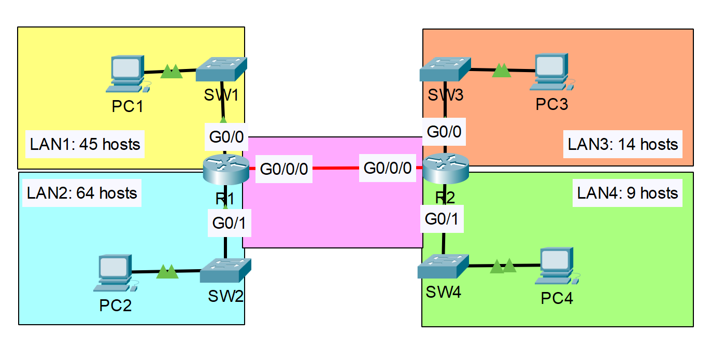

# 🧪**SUBNETTING WITH VLSM (Variable Length Subnet Masking)**

> **Category:** Networking / Virtualization / Security / Storage / Cloud  
> **Date:** 2025-10-05  
> **Author:** `Collins Chinedu Amalimeh`
> **Tools Used:** `Cisco Packet Tracer`
> **Difficulty Level:** `Beginner / **Intermediate** / Advanced`  
> **Status:** 🧭 In Progress
<!-- ✅ Completed /  -->
---

## 📝 **Project Overview**
In this lab, I will use **Variable Length Subnet Masking (VLSM)** to allocate IP addresses for hosts of varying sizes across four subnets. I will also configure static routes to enable inter-LAN communication between these subnets.

---

## 🎯 **Objectives**
- [ ] Subnet the `192.168.5.0/24` network to provide sufficient addressing for each of the 4 LAN  
- [ ] Assign the first usable address to the PC in each LAN  
- [ ] Assign the last usable address to the router's interface in each LAN
- [ ] Configure static routes on each router routing-table for inter-LAN connectivity 

---

## ⚙️ **Configuration Steps**
1. Step 1 — Build LANs Topology
2. Step 2 — Allocate a network prefix lenght to LANs based on host need.
3. Step 3 — Configure Router interfaces with IP address
4. Step 4 — Configure IP-address, NetMask and Default Gateway for endhosts in the LANs
5. Step 5 — Configure Static Routes to make all the LAN reachable.
6. Step 6 — Verify routing between LANs

---

## 🌐 **Topology Diagram**
  
**Figure 1.0** The Network Topology - Copied from the task from Jeromy's CCNA Lab*

---
`Note!` 

Unlike Fixed Length Subnet Masking (FLSM), Variable Length Subnet Masking (VLSM) allows us to efficiently subnet a given IPv4 network—such as 192.168.5.0/24—by assigning different subnet sizes based on host requirements. While FLSM uses CIDR to segment a network into equal-sized subnets, it lacks the flexibility to tailor subnet sizes to actual host needs, often resulting in wasted IP addresses. In this lab, the topology includes four LANs with varying host sizes connected via routers. Applying a uniform /26 prefix would provide 62 usable IP addresses per subnet, which is more than sufficient for some LANs but leads to inefficient IP allocation and leaves no room for point-to-point connections. VLSM solves this by enabling precise subnet sizing and preserving IP space for future growth. 

---

### **Subnetting the `192.168.5.0/24` network** ###
To efficiently subnet the network using VLSM, we must begin with the LAN that requires the largest number of hosts and work down to the smallest. This ensures optimal IP address allocation and prevents fragmentation. It's crucial to avoid any overlap between subnets. When calculating the required number of IP addresses for each subnet, we must add 2 to the host count to account for the network and broadcast addresses

#### 🧰 **Subnets**
|LAN    |Subnet with prefix  | Subnet Block Size  | Host requirement      | IP Range    |
|-------|---------------------|--------------------|-----------------------|-------------|
| LAN 2 |**192.168.5.0/25**   | 128                | `64`  + 2             | **192.168.5.0 - 192.168.5.127**   |
| LAN 1 |**192.168.5.128/26**   | 64               | `45`  + 2             | **192.168.5.128 - 192.168.5.191**   |
| LAN 3 |**192.168.5.192/27 or /28**  | 32         | `14`  + 2             | **192.168.5.192 - 192.168.223.127**   |
| LAN 4 |**192.168.5.224/28**   | 16               | `9`   + 2             | **192.168.5.224 - 192.168.5.239**   |
| P2P   |**192.168.5.240/30**   | 4                | `2`   + 2             | **192.168.5.240 - 192.168.5.243**   |

