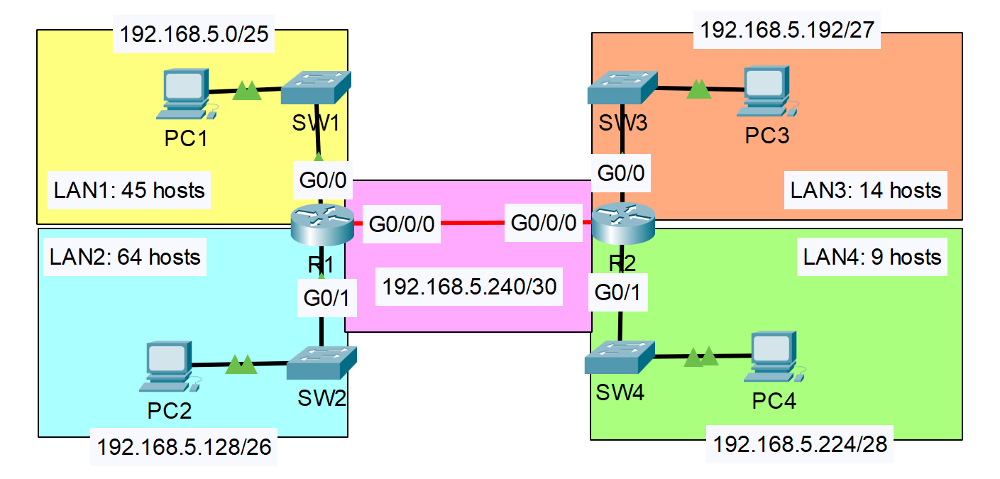
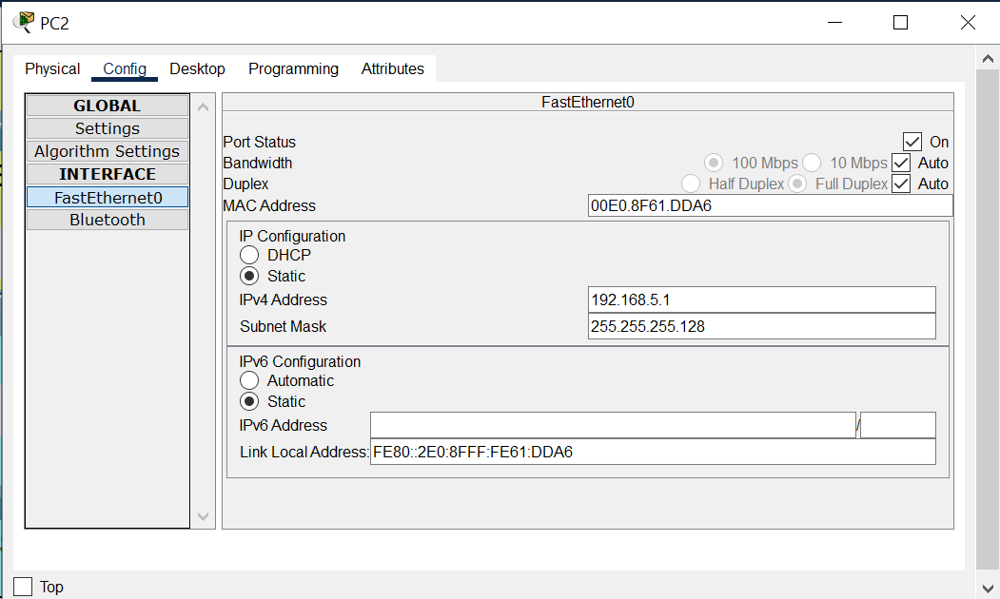
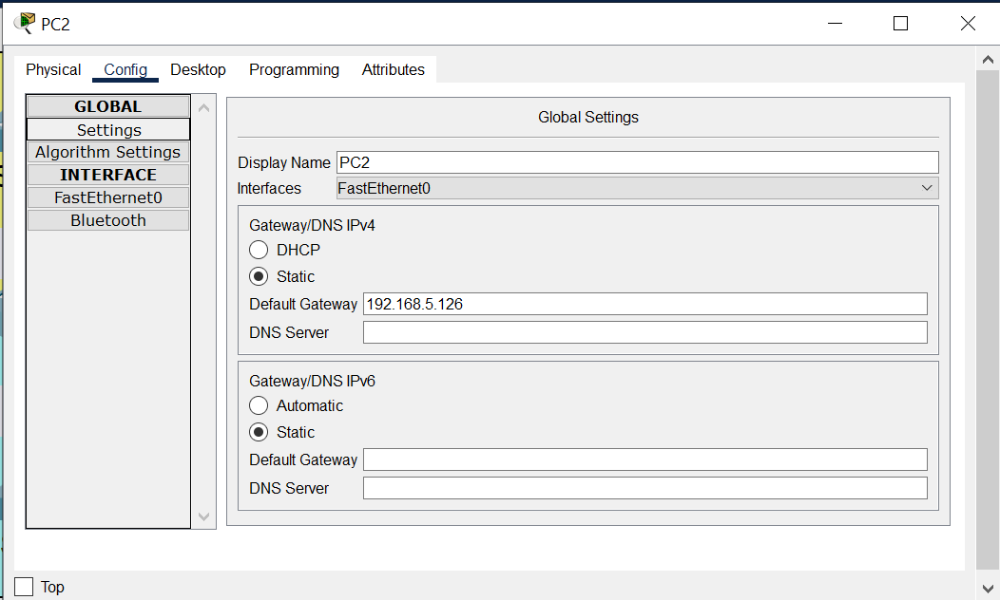

# 🧪**SUBNETTING WITH VLSM (Variable Length Subnet Masking)**

> **Category:** Networking / Virtualization / Security / Storage / Cloud  
> **Date:** 2025-10-05  
> **Author:** `Collins Chinedu Amalimeh`
> **Tools Used:** `Cisco Packet Tracer`
> **Difficulty Level:** Beginner / `Intermediate` / Advanced  
> **Status:** ✅ Completed
<!-- ✅ Completed 🧭 In Progress/  -->
---

## 📝 **Project Overview**
In this lab, I will use **Variable Length Subnet Masking (VLSM)** to allocate IP addresses for hosts of varying sizes across four subnets. I will also configure static routes to enable inter-LAN communication between these subnets.

---

## 🎯 **Objectives**
- [ ] Subnet the `192.168.5.0/24` network to provide sufficient addressing for each of the 4 LAN  
- [ ] Assign the first usable address to the PC in each LAN  
- [ ] Assign the last usable address to the router's interface in each LAN
- [ ] Configure static routes on each router routing-table for inter-LAN connectivity 

---

## ⚙️ **Configuration Steps**
1. Step 1 — Build LANs Topology
2. Step 2 — Allocate a network prefix lenght to LANs based on host need.
3. Step 3 — Configure Router interfaces with IP address
4. Step 4 — Configure IP-address, NetMask and Default Gateway for endhosts in the LANs
5. Step 5 — Configure Static Routes to make all the LAN reachable.
6. Step 6 — Verify routing is working between LANs

---

### 🌐 Step 1:   **Topology Diagram**
  
**Figure 1.0** The Network Topology - Copied from the task from Jeromy's CCNA Lab*

---
`Note!` 

Unlike Fixed Length Subnet Masking (FLSM), Variable Length Subnet Masking (VLSM) allows us to efficiently subnet a given IPv4 network—such as 192.168.5.0/24—by assigning different subnet sizes based on host requirements. While FLSM uses CIDR to segment a network into equal-sized subnets, it lacks the flexibility to tailor subnet sizes to actual host needs, often resulting in wasted IP addresses. In this lab, the topology includes four LANs with varying host sizes connected via routers. Applying a uniform /26 prefix would provide 62 usable IP addresses per subnet, which is more than sufficient for some LANs but leads to inefficient IP allocation and leaves no room for point-to-point connections. VLSM solves this by enabling precise subnet sizing and preserving IP space for future growth. 

---

### **Step 2: Subnetting the `192.168.5.0/24` network** ###
To efficiently subnet the network using VLSM, we must begin with the LAN that requires the largest number of hosts and work down to the smallest. This ensures optimal IP address allocation and prevents fragmentation. It's crucial to avoid any overlap between subnets. When calculating the required number of IP addresses for each subnet, we must add 2 to the host count to account for the network and broadcast addresses

> #### 🧰 **Subnets**
|LAN    |Subnet with prefix  | Subnet Block Size  | Host requirement      | IP Range    |
|-------|---------------------|--------------------|-----------------------|-------------|
| LAN 2 |**192.168.5.0/25**   | 128                | `64`  + 2             | **192.168.5.0 - 192.168.5.127**   |
| LAN 1 |**192.168.5.128/26** | 64                 | `45`  + 2             | **192.168.5.128 - 192.168.5.191**   |
| LAN 3 |**192.168.5.192/27**   | 32                 | `14`  + 2           | **192.168.5.192 - 192.168.5.223**   |
| LAN 4 |**192.168.5.224/28** | 16                 | `9`   + 2             | **192.168.5.224 - 192.168.5.239**   |
| P2P   |**192.168.5.240/30** | 4                  | `2`   + 2             | **192.168.5.240 - 192.168.5.243**   |

---

> #### **Updated Topology with Subnet Allocations**
  
**Figure 2.0** Updated network topology diagram showing the subnet assignment for each LAN

---

### Step 3: Configuring The Router Interfaces
In this section, we will configure the IP addresses for the router interfaces, beginning with R1 followed by R2. Each interface connected to a LAN or point-to-point link will be assigned its designated IP address based on the subnet plan.

| Router Interface | IP address  | Subnet Mask    | 
|------------------|-------------|----------------|
|R1 G0/1   (LAN2)  |**192.168.5.126**|255.255.255.128 |
|R1 G0/0   (LAN1)  |**192.168.5.190**|255.255.255.192|
|R2 G0/0   (LAN3)  |**192.168.5.222**|255.255.255.224 |
|R2 G0/1   (LAN4)  |**192.168.5.238**|255.255.255.240 |
|R1 G0/0/0           |**192.168.5.241**|255.255.255.5.252 |
|R2 G0/0/0           |**192.168.5.242**|255.255.255.5.252 |
---
> configuring Router 1 / LAN2 interface with IP address
```bash
Router1#enable
Router1#conf t
Enter configuration commands, one per line.  End with CNTL/Z.
Router1(config)#
Router1(config)#
Router1(config)#int g0/1
Router1(config-if)#ip add
Router1(config-if)#ip address 192.168.5.126 255.255.255.128
Router1(config-if)#no shutdown

Router1(config-if)#
%LINK-5-CHANGED: Interface GigabitEthernet0/1, changed state to up
```
The rest of the interfaces should be configured the same way using the same command, and using the above table as reference on IP assignment. _(Assigning last usable host to the interfaces)_

Next, I will check the router's interface to ensure that IP address were assigned correctly. 
```bash
Router1#
Router1#
Router1#show ip int
Router1#show ip interface bri
Interface              IP-Address      OK? Method Status                Protocol 
GigabitEthernet0/0     192.168.5.190   YES manual up                    up 
GigabitEthernet0/1     192.168.5.126   YES manual up                    up 
GigabitEthernet0/2     unassigned      YES unset  administratively down down 
GigabitEthernet0/0/0   192.168.5.241   YES manual up                    up 
Vlan1                  unassigned      YES unset  administratively down down
```


> Lets do the same for R2
```bash
Router2#
Router2#
Router2#show ip int
Router2#show ip interface bri
Interface              IP-Address      OK? Method Status                Protocol 
GigabitEthernet0/0     192.168.5.222   YES manual up                    up 
GigabitEthernet0/1     192.168.5.238   YES manual up                    up 
GigabitEthernet0/2     unassigned      YES unset  administratively down down 
GigabitEthernet0/0/0   192.168.5.242   YES manual up                    up 
Vlan1                  unassigned      YES unset  administratively down down

```

---
### **Step 4: Configure IP-address, NetMask and Default Gateway for endhosts in the LANs** 

  
**Figure 3.0** Configuring the PC2 IP-address and 
Subnet Mask


  
**Figure 4.0** Configuring the PC2 Default Gateway

---

### **Step 5: Configure Static Routes to make all the LAN reachable.**
By configuring static routes on the routers, we enable communication with networks that are not directly connected to the same router. A route is an entry in the routing table that instructs the router where to forward packets destined for remote networks.

The table below lists the subnets directly connected to routers R1 and R2, along with the remote networks and their respective next-hop addresses.

|Router| Destination | Next-Hop |
|------|-------------|----------|
|R1    | 192.168.5.192/27| 192.168.5.242|
|      | 192.168.5.224/28| |
|R1    | 192.168.5.0/25  | connected|
|      | 192.168.5.128/26  | |
|R2    | 192.168.5.0/25  | 192.168.5.241|
|      | 192.168.5.128/26  |       |
|R2    | 192.168.5.192/27 | connected|
|      | 192.168.5.224/28 |          |


> #### Configuring Static route on R1
```bash
Router1#conf t
Enter configuration commands, one per line.  End with CNTL/Z.
Router1(config)#
Router1(config)#
Router1(config)#ip route
Router1(config)#ip route 192.168.5.192 255.255.255.224 192.168.5.242
Router1(config)#ip route 192.168.5.224 255.255.255.240 192.168.5.242
```
Displaying the route table to show configured route:
```bash
Router1#
Router1#show ip route
Codes: L - local, C - connected, S - static, R - RIP, M - mobile, B - BGP
       D - EIGRP, EX - EIGRP external, O - OSPF, IA - OSPF inter area
       N1 - OSPF NSSA external type 1, N2 - OSPF NSSA external type 2
       E1 - OSPF external type 1, E2 - OSPF external type 2, E - EGP
       i - IS-IS, L1 - IS-IS level-1, L2 - IS-IS level-2, ia - IS-IS inter area
       * - candidate default, U - per-user static route, o - ODR
       P - periodic downloaded static route

Gateway of last resort is not set

     192.168.5.0/24 is variably subnetted, 8 subnets, 5 masks
C       192.168.5.0/25 is directly connected, GigabitEthernet0/1
L       192.168.5.126/32 is directly connected, GigabitEthernet0/1
C       192.168.5.128/26 is directly connected, GigabitEthernet0/0
L       192.168.5.190/32 is directly connected, GigabitEthernet0/0
S       192.168.5.192/27 [1/0] via 192.168.5.242
S       192.168.5.224/28 [1/0] via 192.168.5.242
C       192.168.5.240/30 is directly connected, GigabitEthernet0/0/0
L       192.168.5.241/32 is directly connected, GigabitEthernet0/0/0

```
> Configuring Static routes on R2
```bash
Router2#conf t
Enter configuration commands, one per line.  End with CNTL/Z.
Router2(config)#
Router2(config)#
Router2(config)#ip route
Router2(config)#ip route 192.168.5.0 255.255.255.128 192.168.5.241
Router2(config)#ip route 192.168.5.128 255.255.255.192 192.168.5.241
```
Displaying the R2 route table to show configured route:
```bash

R2>
R2>enab
Password: 
R2#show ip route
Codes: L - local, C - connected, S - static, R - RIP, M - mobile, B - BGP
       D - EIGRP, EX - EIGRP external, O - OSPF, IA - OSPF inter area
       N1 - OSPF NSSA external type 1, N2 - OSPF NSSA external type 2
       E1 - OSPF external type 1, E2 - OSPF external type 2, E - EGP
       i - IS-IS, L1 - IS-IS level-1, L2 - IS-IS level-2, ia - IS-IS inter area
       * - candidate default, U - per-user static route, o - ODR
       P - periodic downloaded static route

Gateway of last resort is not set

     192.168.5.0/24 is variably subnetted, 8 subnets, 5 masks
S       192.168.5.0/24 [1/0] via 192.168.5.241
S       192.168.5.128/26 [1/0] via 192.168.5.241
C       192.168.5.192/27 is directly connected, GigabitEthernet0/0
L       192.168.5.222/32 is directly connected, GigabitEthernet0/0
C       192.168.5.224/28 is directly connected, GigabitEthernet0/1
L       192.168.5.222/32 is directly connected, GigabitEthernet0/1
C       192.168.5.240/30 is directly connected, GigabitEthernet0/0/0
L       192.168.5.242/32 is directly connected, GigabitEthernet0/0/0
```
---

### **Step 6: Verify routing is working between LANs**
> From PC1 I will ping PC3 in the LAN 3.

```bash
PC1:

Cisco Packet Tracer PC Command Line 1.0
C:\>ping 192.168.5.193

Pinging 192.168.5.193 with 32 bytes of data:

Request timed out.
Reply from 192.168.5.193: bytes=32 time=12ms TTL=254
Reply from 192.168.5.193: bytes=32 time<1ms TTL=254
Reply from 192.168.5.193: bytes=32 time<1ms TTL=254

Ping statistics for 192.168.5.193:
    Packets: Sent = 4, Received = 3, Lost = 1 (25% loss),
Approximate round trip times in milli-seconds:
    Minimum = 0ms, Maximum = 12ms, Average = 4ms
```
---

> From PC4 I will ping PC2 in the LAN 2.
```bash
Cisco Packet Tracer PC Command Line 1.0
C:\>ping 192.168.5.1

Pinging 192.168.5.1 with 32 bytes of data:

Request timed out.
Reply from 192.168.5.1: bytes=32 time<1ms TTL=126
Reply from 192.168.5.1: bytes=32 time<1ms TTL=126
Reply from 192.168.5.1: bytes=32 time<1ms TTL=126

Ping statistics for 192.168.5.1:
    Packets: Sent = 4, Received = 3, Lost = 1 (25% loss),
Approximate round trip times in milli-seconds:
    Minimum = 0ms, Maximum = 0ms, Average = 0ms

C:\>
C:\>
```

## **Conclusion**:
The ping test between subnets confirms that subnetting was implemented correctly and validates the static routing configuration on the point-to-point interfaces between routers. Each subnet can successfully reach end devices outside its own broadcast domain. 

Contact me: collinsama343@yahoo.com

💬 If you have any suggestions or contributions, feel free to reach out, I’d love to hear from you. 🛠️ Although this blog is complete for now, I’ll continue updating it with new insights and improvements in the future.

